# Chapter 10

# Convolutional networks

Chapters 2–9 introduced the supervised learning pipeline for deep neural networks. How-ever, these chapters only considered fully connected networks with a single path frominput to output. Chapters 10–13 introduce more specialized network components withsparser connections, shared weights, and parallel processing paths. This chapter de-scribes convolutional layers, which are mainly used for processing image data.

Images have three properties that suggest the need for specialized model architec-ture. First, they are high-dimensional. A typical image for a classification task contains224×224 RGB values (i.e., 150,528 input dimensions). Hidden layers in fully connectednetworks are generally larger than the input size, so even for a shallow network, thenumber of weights would exceed 150, 5282, or 22 billion. This poses obvious practicalproblems in terms of the required training data, memory, and computation.

Second, nearby image pixels are statistically related. However, fully connected net-works have no notion of “nearby” and treat the relationship between every input equally.If the pixels of the training and test images were randomly permuted in the same way,the network could still be trained with no practical difference. Third, the interpretationof an image is stable under geometric transformations. An image of a tree is still animage of a tree if we shift it leftwards by a few pixels. However, this shift changes everyinput to the network. Hence, a fully connected model must learn the patterns of pixelsthat signify a tree separately at every position, which is clearly inefficient.

Convolutional layers process each local image region independently, using parametersshared across the whole image. They use fewer parameters than fully connected layers,exploit the spatial relationships between nearby pixels, and don’t have to re-learn theinterpretation of the pixels at every position. A network predominantly consisting ofconvolutional layers is known as a convolutional neural network or CNN.

# 10.1 Invariance and equivariance

We argued above that some properties of images (e.g., tree texture) are stable undertransformations. In this section, we make this idea more mathematically precise. Afunction f[x] of an image x is invariant to a transformation t[x] if:

a)

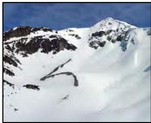

c)

e)

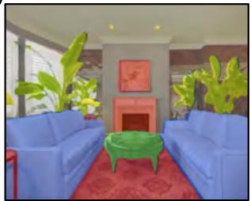

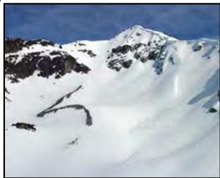

d)

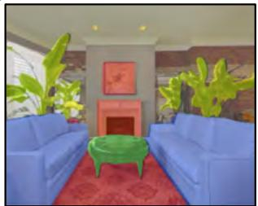

Figure 10.1 Invariance and equivariance for translation. a–b) In image classi-fication, the goal is to categorize both images as “mountain” regardless of thehorizontal shift that has occurred. In other words, we require the network pre-diction to be invariant to translation. c,e) The goal of semantic segmentation isto associate a label with each pixel. d,f) When the input image is translated, wewant the output (colored overlay) to translate in the same way. In other words,we require the output to be equivariant with respect to translation. Panels c–f)adapted from Bousselham et al. (2021).

$$
\mathbf {f} [ \mathbf {t} [ \mathbf {x} ] ] = \mathbf {f} [ \mathbf {x} ]. \tag {10.1}
$$

In other words, the output of the function f[x] is the same regardless of the transfor-mation t[x]. Networks for image classification should be invariant to geometric trans-formations of the image (figure 10.1a–b). The network f[x] should identify an image ascontaining the same object, even if it has been translated, rotated, flipped, or warped.

A function f[x] of an image x is equivariant or covariant to a transformation t[x] if:

$$
\mathbf {f} \big [ \mathbf {t} [ \mathbf {x} ] \big ] = \mathbf {t} \big [ \mathbf {f} [ \mathbf {x} ] \big ]. \tag {10.2}
$$

In other words, f[x] is equivariant to the transformation t[x] if its output changes inthe same way under the transformation as the input. Networks for per-pixel imagesegmentation should be equivariant to transformations (figure 10.1c–f); if the image istranslated, rotated, or flipped, the network f[x] should return a segmentation that hasbeen transformed in the same way.

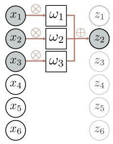

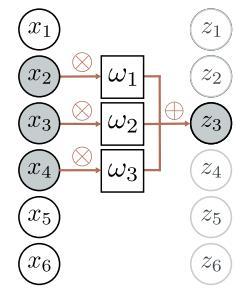

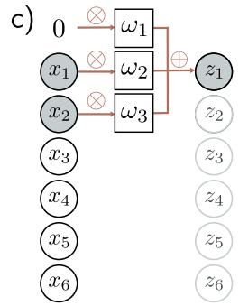

d)

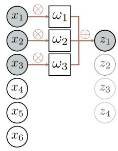

Figure 10.2 1D convolution with kernel size three. Each output $z _ { i }$ is $\mathrm { a }$ weightedsum of the nearest three inputs $x _ { i - 1 } , \ x _ { i } ,$ and $x _ { i + 1 }$ , where the weights are $\omega =$[ω1, ω2, ω3]. a) Output $z _ { 2 }$ is computed as $z _ { 2 } = \omega _ { 1 } x _ { 1 } + \omega _ { 2 } x _ { 2 } + \omega _ { 3 } x _ { 3 } .$ . b) Output $z _ { 3 }$is computed as $z _ { 3 } = \omega _ { 1 } x _ { 2 } + \omega _ { 2 } x _ { 3 } + \omega _ { 3 } x _ { 4 } . \mathrm { ~ c ~ } )$ At position $z _ { 1 } ,$ the kernel extendsbeyond the first input $x _ { 1 } .$ . This can be handled by zero padding, in which weassume values outside the input are zero. The final output is treated similarly.d) Alternatively, we could only compute outputs where the kernel fits within theinput range (“valid” convolution); now, the output will be smaller than the input.

# 10.2 Convolutional networks for 1D inputs

Convolutional networks consist of a series of convolutional layers, each of which is equiv-ariant to translation. They also typically include pooling mechanisms that induce partialinvariance to translation. For clarity of exposition, we first consider convolutional net-works for 1D data, which are easier to visualize. In section 10.3, we progress to 2Dconvolution, which can be applied to image data.

# 10.2.1 1D convolution operation

Convolutional layers are network layers based on the convolution operation. In 1D, aconvolution transforms an input vector x into an output vector z so that each output$z _ { i }$ is a weighted sum of nearby inputs. The same weights are used at every position andare collectively called the convolution kernel or filter. The region over which inputs areweighted and summed is termed the kernel size. For a kernel size of three, we have:

$$
z _ {i} = \omega_ {1} x _ {i - 1} + \omega_ {2} x _ {i} + \omega_ {3} x _ {i + 1}, \tag {10.3}
$$

where ${ \boldsymbol { \omega } } = [ \omega _ { 1 } , \omega _ { 2 } , \omega _ { 3 } ] ^ { T }$ is the kernel (figure 10.2).1 Notice that the convolution oper-ation is equivariant with respect to translation. If we translate the input x, then thecorresponding output z is translated in the same way.

Problem 10.1

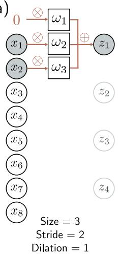

b)

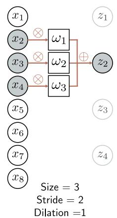

c)

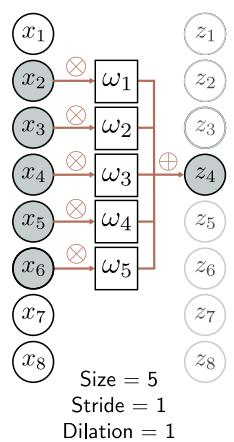

d)

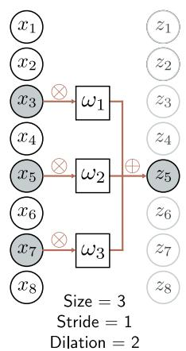

Figure 10.3 Stride, kernel size, and dilation. a) With a stride of two, we evaluatethe kernel at every other position, so the first output z1 is computed from aweighted sum centered at x1, and b) the second output z2 is computed from aweighted sum centered at x3 and so on. c) The kernel size can also be changed.With a kernel size of five, we take a weighted sum of the nearest five inputs. d) Indilated or atrous convolution, we intersperse zeros in the weight vector to allowus to combine information over a large area using fewer weights.

# 10.2.2 Padding

Equation 10.3 shows that each output is computed by taking a weighted sum of theprevious, current, and subsequent positions in the input. This begs the question of howto deal with the first output (where there is no previous input) and the final output(where there is no subsequent input).

There are two common approaches. The first is to pad the edges of the inputs withnew values and proceed as usual. Zero padding assumes the input is zero outside itsvalid range (figure 10.2c). Other possibilities include treating the input as circular orreflecting it at the boundaries. The second approach is to discard the output positionswhere the kernel exceeds the range of input positions. These valid convolutions have theadvantage of introducing no extra information at the edges of the input. However, theyhave the disadvantage that the representation decreases in size.

# 10.2.3 Stride, kernel size, and dilation

In the example above, each output was a sum of the nearest three inputs. However,this is just one of a larger family of convolution operations, the members of which aredistinguished by their stride, kernel size, and dilation rate. When we evaluate the outputat every position, we term this a stride of one. However, it is also possible to shift thekernel by a stride greater than one. If we have a stride of two, we create roughly halfthe number of outputs (figure 10.3a–b).

The kernel size can be increased to integrate over a larger area (figure 10.3c). How-ever, it typically remains an odd number so that it can be centered around the currentposition. Increasing the kernel size has the disadvantage of requiring more weights. Thisleads to the idea of dilated or atrous convolutions, in which the kernel values are inter-spersed with zeros. For example, we can turn a kernel of size five into a dilated kernel ofsize three by setting the second and fourth elements to zero. We still integrate informa-tion from a larger input region but only require three weights to do this (figure 10.3d).The number of zeros we intersperse between the weights determines the dilation rate.

Problems 10.2–10.4

# 10.2.4 Convolutional layers

A convolutional layer computes its output by convolving the input, adding a bias $\beta ,$ andpassing each result through an activation function a[•]. With kernel size three, strideone, and dilation rate one, the $i ^ { t h }$ hidden unit $h _ { i }$ would be computed as:

$$
\begin{array}{l} {h _ {i}} = {\mathrm{a} \left[ \beta + \omega_ {1} x _ {i - 1} + \omega_ {2} x _ {i} + \omega_ {3} x _ {i + 1} \right]} \\ = \text { a } \left[ \beta + \sum_ {j = 1} ^ {3} \omega_ {j} x _ {i + j - 2} \right], \tag {10.4} \\ \end{array}
$$

where the bias $\beta$ and kernel weights ω1, ω2, ω3 are trainable parameters, and (with zeropadding) we treat the input x as zero when it is out of the valid range. This is a specialcase of a fully connected layer that computes the $i ^ { t h }$ hidden unit as:

$$
h _ {i} = \mathrm{a} \left[ \beta_ {i} + \sum_ {j = 1} ^ {D} \omega_ {i j} x _ {j} \right]. \tag {10.5}
$$

If there are D inputs $x _ { \bullet }$ and D hidden units $h _ { \bullet }$ , this fully connected layer would have $D ^ { 2 }$weights $\omega _ { \bullet \bullet }$ and D biases $\beta _ { \bullet }$ . The convolutional layer only uses three weights and onebias. A fully connected layer can reproduce this exactly if most weights are set to zeroand others are constrained to be identical (figure 10.4).

Problem 10.5

# 10.2.5 Channels

If we only apply a single convolution, information will inevitably be lost; we are averagingnearby inputs, and the ReLU activation function clips results that are less than zero.Hence, it is usual to compute several convolutions in parallel. Each convolution producesa new set of hidden variables, termed a feature map or channel.

a)

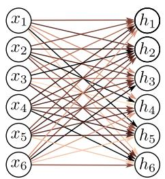

c)

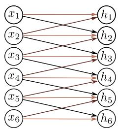

e)

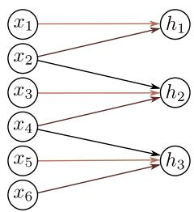

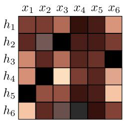

d)

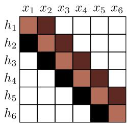

f)

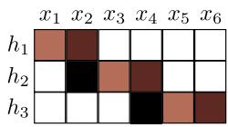

Figure 10.4 Fully connected vs. convolutional layers. a) A fully connected layerhas a weight connecting each input x to each hidden unit h (colored arrows)and a bias for each hidden unit (not shown). b) Hence, the associated weightmatrix Ω contains 36 weights relating the six inputs to the six hidden units. c) Aconvolutional layer with kernel size three computes each hidden unit as the sameweighted sum of the three neighboring inputs (arrows) plus a bias (not shown).d) The weight matrix is a special case of the fully connected matrix where manyweights are zero and others are repeated (same colors indicate same value, whiteindicates zero weight). e) A convolutional layer with kernel size three and stridetwo computes a weighted sum at every other position. f) This is also a specialcase of a fully connected network with a different sparse weight structure.

a)

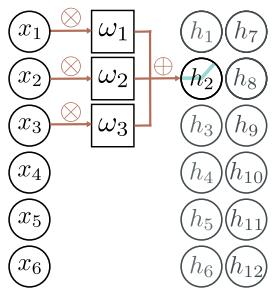

b)

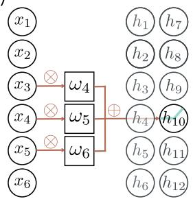

c

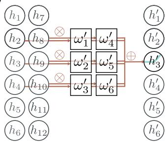

Figure 10.5 Channels. Typically, multiple convolutions are applied to the input xand stored in channels. a) A convolution is applied to create hidden units h1to $h _ { 6 } ,$ , which form the first channel. b) A second convolution operation is appliedto create hidden units $h _ { 7 }$ to $h _ { 1 2 }$ , which form the second channel. The channelsare stored in a 2D array $\mathbf { H } _ { 1 }$ that contains all the hidden units in the first hiddenlayer. c) If we add a further convolutional layer, there are now two channels ateach input position. Here, the 1D convolution defines a weighted sum over bothinput channels at the three closest positions to create each new output channel.

Figure 10.5a–b illustrates this with two convolution kernels of size three and withzero padding. The first kernel computes a weighted sum of the nearest three pixels, addsa bias, and passes the results through the activation function to produce hidden units $h _ { 1 }$to $h _ { 6 }$ . These comprise the first channel. The second kernel computes a different weightedsum of the nearest three pixels, adds a different bias, and passes the results through theactivation function to create hidden units $h _ { 7 }$ to $h _ { 1 2 }$ . These comprise the second channel.

In general, the input and the hidden layers all have multiple channels (figure 10.5c).If the incoming layer has $C _ { i }$ channels and kernel size $K ,$ , the hidden units in each outputchannel are computed as a weighted sum over all $C _ { i }$ channels and K kernel positionsusing a weight matrix $\pmb { \Omega } \in \mathbb { R } ^ { C _ { i } \times \bar { \kappa } }$ and one bias. Hence, if there are $C _ { o }$ channels in thenext layer, then we need $\Omega \in \mathbb { R } ^ { C _ { i } \times C _ { o } \times K }$ weights and $\beta \in \mathbb { R } ^ { C _ { o } }$ biases.

Problems 10.6–10.8

Notebook 10.11D convolution

# 10.2.6 Convolutional networks and receptive fields

Chapter 4 described deep networks, which consisted of a sequence of fully connectedlayers. Similarly, convolutional networks comprise a sequence of convolutional layers.The receptive field of a hidden unit in the network is the region of the original input thatfeeds into it. Consider a convolutional network where each convolutional layer has kernelsize three. The hidden units in the first layer take a weighted sum of the three closestinputs, so have receptive fields of size three. The units in the second layer take a weightedsum of the three closest positions in the first layer, which are themselves weighted sumsof three inputs. Hence, the hidden units in the second layer have a receptive field of sizefive. In this way, the receptive field of units in successive layers increases, and informationfrom across the input is gradually integrated (figure 10.6).

Problems 10.9–10.11

# 10.2.7 Example: MNIST-1D

We now apply a convolutional network to the MNIST-1D data (see figure 8.1). Theinput x is a 40D vector, and the output f is a 10D vector that is passed through asoftmax layer to produce class probabilities. We use a network with three hidden layers(figure 10.7). The fifteen channels of the first hidden layer $\mathbf { H } _ { 1 }$ are each computed usinga kernel size of three and a stride of two with “valid” padding, giving nineteen spatialpositions. The second hidden layer $\mathbf { H } _ { 2 }$ is also computed using a kernel size of three, astride of two, and “valid” padding. The third hidden layer is computed similarly. At thisstage, the representation has four spatial positions and fifteen channels. These valuesare reshaped into a vector of size sixty, which is mapped by a fully connected layer tothe ten output activations.

This network was trained for 100,000 steps using SGD without momentum, a learningrate of 0.01, and a batch size of 100 on a dataset of 4,000 examples. We compare this toa fully connected network with the same number of layers and hidden units (i.e., threehidden layers with 285, 135, and 60 hidden units, respectively). The convolutional net-work has 2,050 parameters, and the fully connected network has 150,185 parameters. Bythe logic of figure 10.4, the convolutional network is a special case of the fully connected

Problem 10.12

a

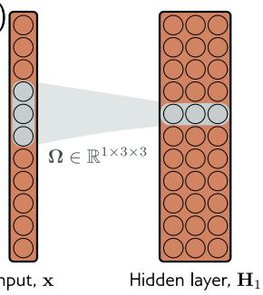

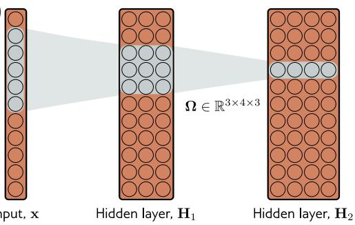

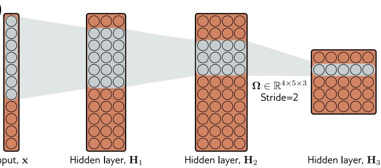

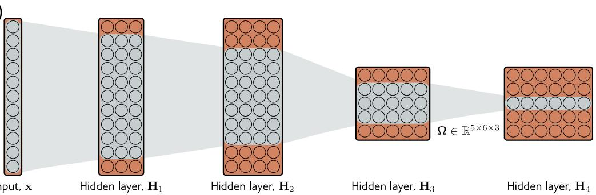

Figure 10.6 Receptive fields for network with kernel width of three. a) An inputwith eleven dimensions feeds into a hidden layer with three channels and convo-lution kernel of size three. The pre-activations of the three highlighted hiddenunits in the first hidden layer $\mathbf { H } _ { 1 }$ are different weighted sums of the nearest threeinputs, so the receptive field in $\mathbf { H } _ { 1 }$ has size three. b) The pre-activations of thefour highlighted hidden units in layer $\mathbf { H } _ { 2 }$ each take a weighted sum of the threechannels in layer $\mathbf { H } _ { 1 }$ at each of the three nearest positions. Each hidden unit inlayer $\mathbf { H } _ { 1 }$ weights the nearest three input positions. Hence, hidden units in $\mathbf { H } _ { 2 }$have a receptive field size of five. $\mathrm { c ) }$ The hidden units in the third layer (kernelsize three, stride two) increases the receptive field size to seven. d) By the timewe add a fourth layer, the receptive field of the hidden units at position threehave a receptive field that covers the entire input.

Notebook 10.2Convolutionfor MNIST-1D

one. The latter has enough flexibility to replicate the former exactly. Figure 10.8 showsboth models fit the training data perfectly. However, the test error for the convolutionalnetwork is much less than for the fully connected network.

This discrepancy is probably not due to the difference in the number of parameters;we know overparameterization usually improves performance (section 8.4.1). The likelyexplanation is that the convolutional architecture has a superior inductive bias $( { \mathrm { i . e . } }$ ,interpolates between the training data better) because we have embodied some priorknowledge in the architecture; we have forced the network to process each position inthe input in the same way. We know that the data were created by starting with atemplate that is (among other operations) randomly translated, so this is sensible.

The fully connected network has to learn what each digit template looks like at everyposition. In contrast, the convolutional network shares information across positions andhence learns to identify each category more accurately. Another way of thinking aboutthis is that when we train the convolutional network, we search through a smaller familyof input/output mappings, all of which are plausible. Alternatively, the convolutionalstructure can be considered a regularizer that applies an infinite penalty to most of thesolutions that a fully connected network can describe.

# 10.3 Convolutional networks for 2D inputs

The previous section described convolutional networks for processing 1D data. Suchnetworks can be applied to financial time series, audio, and text. However, convolutionalnetworks are more usually applied to 2D image data. The convolutional kernel is nowa 2D object. A 3×3 kernel $\bar { \Omega } \in \mathbb { R } ^ { 3 \times 3 }$ applied to a 2D input comprising of elements $x _ { i j }$computes a single layer of hidden units $h _ { i j }$ as:

$$
h _ {i j} = \mathrm{a} \left[ \beta + \sum_ {m = 1} ^ {3} \sum_ {n = 1} ^ {3} \omega_ {m n} x _ {i + m - 2, j + n - 2} \right], \tag {10.6}
$$

Problem 10.13

Notebook 10.32D convolution

Problem 10.14

Appendix B.3Tensors

where $\omega _ { m n }$ are the entries of the convolutional kernel. This is simply a weighted sumover a square 3×3 input region. The kernel is translated both horizontally and verticallyacross the 2D input (figure 10.9) to create an output at each position.

Often the input is an RGB image, which is treated as a 2D signal with three channels(figure 10.10). Here, a 3×3 kernel would have 3×3×3 weights and be applied to thethree input channels at each of the 3×3 positions to create a 2D output that is the sameheight and width as the input image (assuming zero padding). To generate multipleoutput channels, we repeat this process with different kernel weights and append theresults to form a 3D tensor. If the kernel is size $K \times K$ , and there are $C _ { i }$ input channels,each output channel is a weighted sum of $C _ { i } \times K \times K$ quantities plus one bias. It followsthat to compute $C _ { o }$ output channels, we need $C _ { i } \times C _ { o } \times K \times K$ weights and $C _ { o }$ biases.

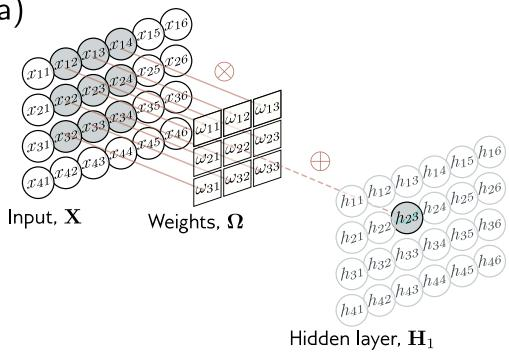

b)

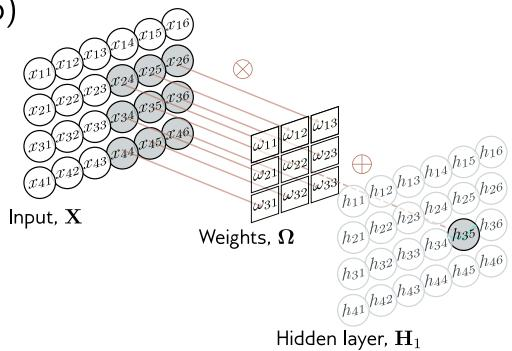

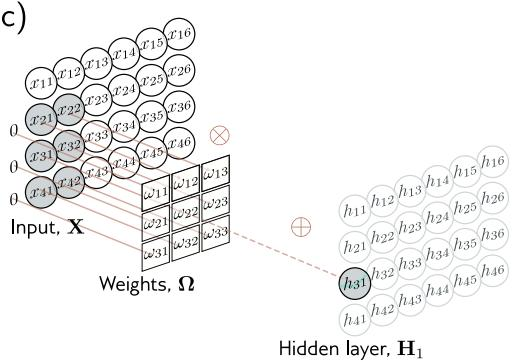

d

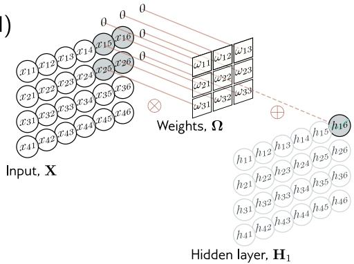

Figure 10.9 2D convolutional layer. Each output $h _ { i j }$ computes a weighted sum ofthe 3×3 nearest inputs, adds a bias, and passes the result through an activationfunction. a) Here, the output $h _ { 2 3 }$ (shaded output) is a weighted sum of the ninepositions from $x _ { 1 2 }$ to x34 (shaded inputs). b) Different outputs are computed bytranslating the kernel across the image grid in two dimensions. c–d) With zeropadding, positions beyond the image’s edge are considered to be zero.

# 10.4 Downsampling and upsampling

The network in figure 10.7 increased receptive field size by scaling down the representa-tion at each layer using stride two convolutions. We now consider methods for scalingdown or downsampling 2D input representations. We also describe methods for scalingthem back up (upsampling), which is useful when the output is also an image. Finally,we consider methods to change the number of channels between layers. This is helpfulwhen recombining representations from two branches of a network (chapter 11).

# 10.4.1 Downsampling

There are three main approaches to scaling down a 2D representation. Here, we considerthe most common case of scaling down both dimensions by a factor of two. First, we

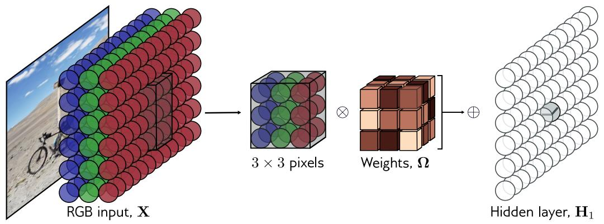

Figure 10.10 2D convolution applied to an image. The image is treated as a 2Dinput with three channels corresponding to the red, green, and blue components.With a 3×3 kernel, each pre-activation in the first hidden layer is computed bypointwise multiplying the 3×3×3 kernel weights with the 3×3 RGB image patchcentered at the same position, summing, and adding the bias. To calculate allthe pre-activations in the hidden layer, we “slide” the kernel over the image inboth horizontal and vertical directions. The output is a 2D layer of hidden units.To create multiple output channels, we would repeat this process with multiplekernels, resulting in a 3D tensor of hidden units at hidden layer H1.

Problem 10.15

can sample every other position. When we use a stride of two, we effectively apply thismethod simultaneously with the convolution operation (figure 10.11a).

Second, max pooling retains the maximum of the 2×2 input values (figure 10.11b).This induces some invariance to translation; if the input is shifted by one pixel, manyof these maximum values remain the same. Finally, mean pooling or average poolingaverages the inputs. For all approaches, we apply downsampling separately to eachchannel, so the output has half the width and height but the same number of channels.

# 10.4.2 Upsampling

The simplest way to scale up a network layer to double the resolution is to duplicateall the channels at each spatial position four times (figure 10.12a). A second methodis max unpooling; this is used where we have previously used a max pooling operationfor downsampling, and we distribute the values to the positions they originated from(figure 10.12b). A third approach uses bilinear interpolation to fill in the missing valuesbetween the points where we have samples. (figure 10.12c).

A fourth approach is roughly analogous to downsampling using a stride of two. Inthat method, there were half as many outputs as inputs, and for kernel size three, eachoutput was a weighted sum of the three closest inputs (figure 10.13a). In transposedconvolution, this picture is reversed (figure 10.13c). There are twice as many outputs

Notebook 10.4Downsampling& upsampling

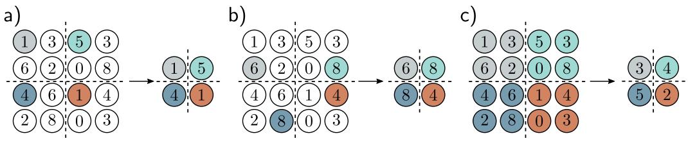

Figure 10.11 Methods for scaling down representation size (downsampling). a)Sub-sampling. The original 4×4 representation (left) is reduced to size $2 { \times } 2 \ : \mathrm { ( r i g h t ) }$by retaining every other input. Colors on the left indicate which inputs contributeto the outputs on the right. This is effectively what happens with a kernel of stridetwo, except that the intermediate values are never computed. b) Max pooling.Each output comprises the maximum value of the corresponding 2×2 block. c)Mean pooling. Each output is the mean of the values in the 2×2 block.

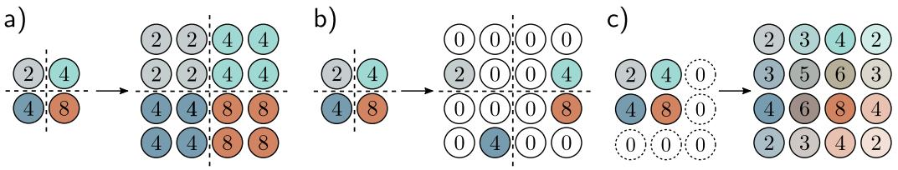

Figure 10.12 Methods for scaling up representation size (upsampling). a) Thesimplest way to double the size of a 2D layer is to duplicate each input fourtimes. b) In networks where we have previously used a max pooling operation(figure 10.11b), we can redistribute the values to the same positions they originallycame from (i.e., where the maxima were). This is known as max unpooling. c) Athird option is bilinear interpolation between the input values.

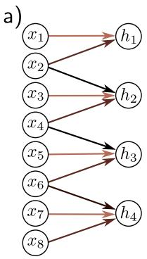

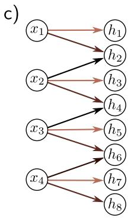

as inputs, and each input contributes to three of the outputs. When we consider theassociated weight matrix of this upsampling mechanism (figure 10.13d), we see that it isthe transpose of the matrix for the downsampling mechanism (figure 10.13b).

# 10.4.3 Changing the number of channels

Sometimes we want to change the number of channels between one hidden layer and thenext without further spatial pooling. This is usually so we can combine the representationwith another parallel computation (see chapter 11). To accomplish this, we apply aconvolution with kernel size one. Each element of the output layer is computed bytaking a weighted sum of all the channels at the same position (figure 10.14). We canrepeat this multiple times with different weights to generate as many output channels aswe need. The associated convolution weights have size $1 \times 1 \times C _ { i } \times C _ { o }$ . Hence, this isknown as 1×1 convolution. Combined with a bias and activation function, it is equivalentto running the same fully connected network on the channels at every position.

# 10.5 Applications

We conclude by describing three computer vision applications. We describe convolu-tional networks for image classification where the goal is to assign the image to one of apredetermined set of categories. Then we consider object detection, where the goal is toidentify multiple objects in an image and find the bounding box around each. Finally,we describe an early system for semantic segmentation where the goal is to assign a labelto each pixel according to which object is present.

# 10.5.1 Image classification

Much of the pioneering work on deep learning in computer vision focused on imageclassification using the ImageNet dataset (figure 10.15). This contains 1,281,167 trainingimages, 50,000 validation images, and 100,000 test images, and every image is labeled asbelonging to one of 1000 possible categories.

Most methods reshape the input images to a standard size; in a typical system,the input x to the network is a 224×224 RGB image, and the output is a probabilitydistribution over the 1000 classes. The task is challenging; there are a large numberof classes, and they exhibit considerable variation (figure 10.15). In 2011, before deepnetworks were applied, the state-of-the-art method classified the test images with ∼ 25%errors for the correct class being in the top five suggestions. Five years later, the bestdeep learning models eclipsed human performance.

In 2012, AlexNet was the first convolutional network to perform well on this task.It consists of eight hidden layers with ReLU activation functions, of which the firstfive are convolutional and the rest fully connected (figure 10.16). The network starts by

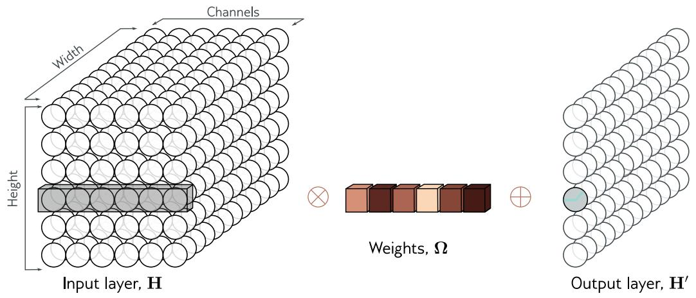

Figure 10.14 1×1 convolution. To change the number of channels without spatialpooling, we apply a 1×1 kernel. Each output channel is computed by takinga weighted sum of all of the channels at the same position, adding a bias, andpassing through an activation function. Multiple output channels are created byrepeating this operation with different weights and biases.

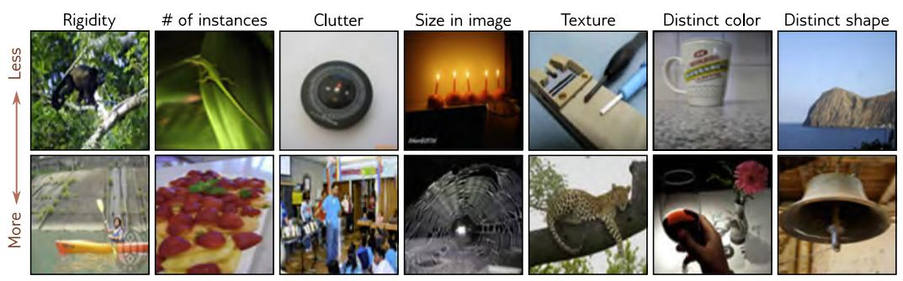

Figure 10.15 Example ImageNet classification images. The model aims to assignan input image to one of 1000 classes. This task is challenging because theimages vary widely along different attributes (columns). These include rigidity(monkey < canoe), number of instances in image (lizard < strawberry), clutter(compass<steel drum), size (candle<spiderweb), texture (screwdriver<leopard),distinctiveness of color (mug < red wine), and distinctiveness of shape (headland< bell). Adapted from Russakovsky et al. (2015).

downsampling the input using an 11×11 kernel with a stride of four to create 96 channels.It then downsamples again using a max pooling layer before applying a 5×5 kernel tocreate 256 channels. There are three more convolutional layers with kernel size 3×3,eventually resulting in a 13×13 representation with 256 channels. This is resized intoa single vector of length 43, 264 and then passed through three fully connected layerscontaining 4096, 4096, and 1000 hidden units, respectively. The last layer is passedthrough the softmax function to output a probability distribution over the 1000 classes.The complete network contains ∼60 million parameters. Most of these are in the fullyconnected layers and the end of the network.

The dataset size was augmented by a factor of 2048 using (i) spatial transformationsand (ii) modifications of the input intensities. At test time, five different cropped andmirrored versions of the image were run through the network, and their predictionsaveraged. The system was learned using SGD with a momentum coefficient of 0.9 and abatch size of 128. Dropout was applied in the fully connected layers, and an L2 (weightdecay) regularizer was used. This system achieved a 16.4% top-5 error rate and a 38.1%top-1 error rate. At the time, this was an enormous leap forward in performance at a taskconsidered far beyond the capabilities of contemporary methods. This result revealedthe potential of deep learning and kick-started the modern era of AI research.

The VGG network was also targeted at classification in the ImageNet task andachieved a considerably better performance of 6.8% top-5 error rate and a 23.7% top-1error rate. This network is similarly composed of a series of interspersed convolutionaland max pooling layers, where the spatial size of the representation gradually decreases,but the number of channels increase. These are followed by three fully connected layers(figure 10.17). The VGG network was also trained using data augmentation, weightdecay, and dropout.

Although there were various minor differences in the training regime, the most impor-tant change between AlexNet and VGG was the depth of the network. The latter used19 hidden layers and 144 million parameters. The networks in figures 10.16 and 10.17are depicted at the same scale for comparison. There was a general trend for severalyears for performance on this task to improve as the depth of the networks increased,and this is evidence that depth is important in neural networks.

# 10.5.2 Object detection

In object detection, the goal is to identify and localize multiple objects within the image.An early method based on convolutional networks was You Only Look Once, or YOLOfor short. The input to the YOLO network is a 448×448 RGB image. This is passedthrough 24 convolutional layers that gradually decrease the representation size usingmax pooling operations while concurrently increasing the number of channels, similarlyto the VGG network. The final convolutional layer is of size $7 \times 7$ and has 1024 channels.This is reshaped to a vector, and a fully connected layer maps it to 4096 values. Onefurther fully connected layer maps this representation to the output.

The output values encode which class is present at each of a $7 \times 7$ grid of locations(figure 10.18a–b). For each location, the output values also encode a fixed number ofbounding boxes. Five parameters define each box: the x- and y-positions of the center,the height and width of the box, and the confidence of the prediction (figure 10.18c).The confidence estimates the overlap between the predicted and ground truth bound-ing boxes. The system is trained using momentum, weight decay, dropout, and dataaugmentation. Transfer learning is employed; the network is initially trained on theImageNet classification task and is then fine-tuned for object detection.

After the network is run, a heuristic process is used to remove rectangles with lowconfidence and to suppress predicted bounding boxes that correspond to the same objectso only the most confident one is retained.

a)

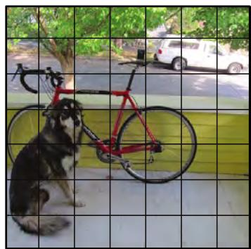

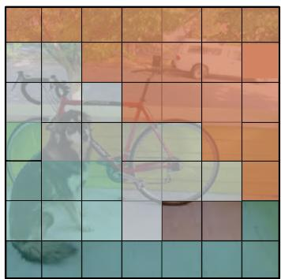

c)

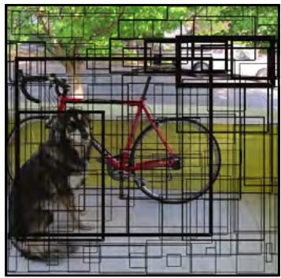

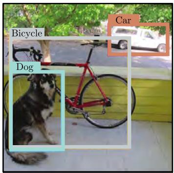

Figure 10.18 YOLO object detection. a) The input image is reshaped to 448×448and divided into a regular 7×7 grid. b) The system predicts the most likely classat each grid cell. c) It also predicts two bounding boxes per cell, and a confidencevalue (represented by thickness of line). d) During inference, the most likelybounding boxes are retained, and boxes with lower confidence values that belongto the same object are suppressed. Adapted from Redmon et al. (2016).

# 10.5.3 Semantic segmentation

The goal of semantic segmentation is to assign a label to each pixel according to the objectthat it belongs to or no label if that pixel does not correspond to anything in the trainingdatabase. An early network for semantic segmentation is depicted in figure 10.19. Theinput is a 224×224 RGB image, and the output is a 224×224×21 array that containsthe probability of each of 21 possible classes at each position.

The first part of the network is a smaller version of VGG (figure 10.17) that containsthirteen rather than fifteen convolutional layers and downsizes the representation to size14×14. There is then one more max pooling operation, followed by two fully connectedlayers that map to two 1D representations of size 4096. These layers do not representspatial position but instead, combine information from across the whole image.

Here, the architecture diverges from VGG. Another fully connected layer reconsti-tutes the representation into 7×7 spatial positions and 512 channels. This is followedby a series of max unpooling layers (see figure 10.12b) and deconvolution layers. Theseare transposed convolutions (see figure 10.13) but in 2D and without the upsampling.Finally, there is a 1×1 convolution to create 21 channels representing the possible classesand a softmax operation at each spatial position to map the activations to class proba-bilities. The downsampling side of the network is sometimes referred to as an encoder,and the upsampling side as a decoder, so networks of this type are sometimes calledencoder-decoder networks or hourglass networks due to their shape.

The final segmentation is generated using a heuristic method that greedily searchesfor the class that is most represented and infers its region, taking into account theprobabilities but also encouraging connectedness. Then the next most-represented classis added where it dominates at the remaining unlabeled pixels. This continues until thereis insufficient evidence to add more (figure 10.20).

# 10.6 Summary

In convolutional layers, each hidden unit is computed by taking a weighted sum of thenearby inputs, adding a bias, and applying an activation function. The weights and thebias are the same at every spatial position, so there are far fewer parameters than in afully connected network, and the parameters don’t increase with the input image size.To ensure that information is not lost, this operation is repeated with different weightsand biases to create multiple channels at each spatial position.

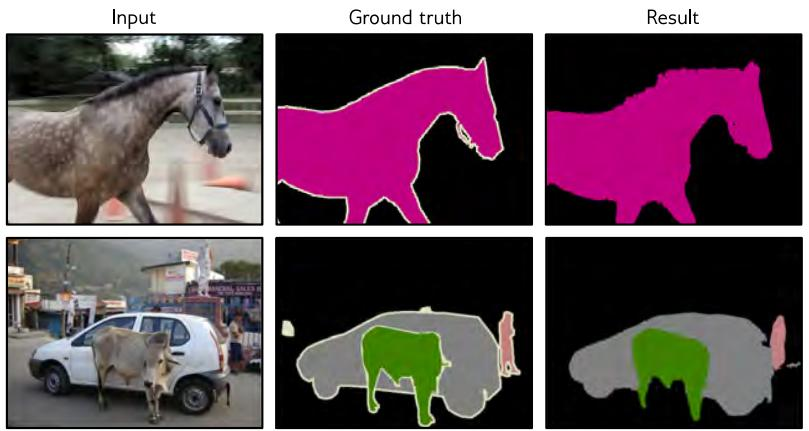

Figure 10.20 Semantic segmentation results. The final result is created from the21 probability maps by greedily selecting the best class and using a heuristicmethod to find a sensible binary map based on the probabilities and their spatialproximity. If there is enough evidence, subsequent classes are added, and theirsegmentation maps are combined. Adapted from Noh et al. (2015).

Typical convolutional networks consist of convolutional layers interspersed with layersthat downsample by a factor of two. As the network progresses, the spatial dimensionsusually decrease by factors of two, and the number of channels increases by factors oftwo. At the end of the network, there are typically one or more fully connected layersthat integrate information from across the entire input and create the desired output. Ifthe output is an image, a mirrored “decoder” upsamples back to the original size.

The translational equivariance of convolutional layers imposes a useful inductive biasthat increases performance for image-based tasks relative to fully connected networks.We described image classification, object detection, and semantic segmentation networks.Image classification performance was shown to improve as the network became deeper.However, subsequent experiments showed that increasing the network depth indefinitelydoesn’t continue to help; after a certain depth, the system becomes difficult to train.This is the motivation for residual connections, which are the topic of the next chapter.

# Notes

Dumoulin & Visin (2016) present an overview of the mathematics of convolutions that expandson the brief treatment in this chapter.

Convolutional networks: Early convolutional networks were developed by Fukushima &Miyake (1982), LeCun et al. (1989a), and LeCun et al. (1989b). Initial applications includedhandwriting recognition (LeCun et al., 1989a; Martin, 1993), face recognition (Lawrence et al.,1997), phoneme recognition (Waibel et al., 1989), spoken word recognition (Bottou et al., 1990),and signature verification (Bromley et al., 1993). However, convolutional networks were popu-larized by LeCun et al. (1998), who built a system called LeNet for classifying 28×28 grayscaleimages of handwritten digits. This is immediately recognizable as a precursor of modern net-works; it uses a series of convolutional layers, followed by fully connected layers, sigmoid activa-tions rather than ReLUs, and average pooling rather than max pooling. AlexNet (Krizhevskyet al., 2012) is widely considered the starting point for modern deep convolutional networks.

ImageNet Challenge: Deng et al. (2009) collated the ImageNet database and the associatedclassification challenge drove progress in deep learning for several years after AlexNet. Notablesubsequent winners of this challenge include the network-in-network architecture (Lin et al.,2014), which alternated convolutions with fully connected layers that operated independentlyon all of the channels at each position (i.e., 1×1 convolutions). Zeiler & Fergus (2014) andSimonyan & Zisserman (2014) trained larger and deeper architectures that were fundamentallysimilar to AlexNet. Szegedy et al. (2017) developed an architecture called GoogLeNet, whichintroduced inception blocks. These use several parallel paths with different filter sizes, whichare then recombined. This effectively allowed the system to learn the filter size.

The trend was for performance to improve with increasing depth. However, it ultimately becamedifficult to train deeper networks without modifications; these include residual connectionsand normalization layers, both of which are described in the next chapter. Progress in theImageNet challenges is summarized in Russakovsky et al. (2015). A more general survey ofimage classification using convolutional networks can be found in Rawat & Wang (2017). Theimprovement of image classification networks over time is visualized in figure 10.21.

Types of convolutional layers: Atrous or dilated convolutions were introduced by Chenet al. (2018c) and Yu & Koltun (2015). Transposed convolutions were introduced by Long et al.(2015). Odena et al. (2016) pointed out that they can lead to checkerboard artifacts and shouldbe used with caution. Lin et al. (2014) is an early example of convolution with 1×1 filters.

Many variants of the standard convolutional layer aim to reduce the number of parameters.These include depthwise or channel-separate convolution (Howard et al., 2017; Tran et al., 2018),in which a different filter convolves each channel separately to create a new set of channels. Fora kernel size of $K \times K$ with C input channels and C output channels, this requires $K \times K \times C$parameters rather than the $K \times K \times C \times C$ parameters in a regular convolutional layer. Arelated approach is grouped convolutions (Xie et al., 2017), where each convolution kernel isonly applied to a subset of the channels with a commensurate reduction in the parameters. Infact, grouped convolutions were used in AlexNet for computational reasons; the whole networkcould not run on a single GPU, so some channels were processed on one GPU and some onanother, with limited interaction points. Separable convolutions treat each kernel as an outerproduct of 1D vectors; they use $C + K + K$ parameters for each of the C channels. Partialconvolutions (Liu et al., 2018a) are used when inpainting missing pixels and account for thepartial masking of the input. Gated convolutions learn the mask from the previous layer (Yuet al., 2019; Chang et al., 2019b). Hu et al. (2018b) propose squeeze-and-excitation networkswhich re-weight the channels using information pooled across all spatial positions.

Downsampling and upsampling: Average pooling dates back to at least LeCun et al. (1989a)and max pooling to Zhou & Chellappa (1988). Scherer et al. (2010) compared these methodsand concluded that max pooling was superior. The max unpooling method was introduced byZeiler et al. (2011) and Zeiler & Fergus (2014). Max pooling can be thought of as applying

Appendix B.3.2Vector norms

an $L _ { \infty }$ norm to the hidden units that are to be pooled. This led to applying other $L _ { k }$ norms(Springenberg et al., 2015; Sainath et al., 2013), although these require more computation andare not widely used. Zhang (2019) introduced max-blur-pooling, in which a low-pass filter isapplied before downsampling to prevent aliasing, and showed that this improves generalizationover translation of the inputs and protects against adversarial attacks (see section 20.4.6).

Shi et al. (2016) introduced PixelShuffle, which used convolutional filters with a stride of $1 / s$to scale up 1D signals by a factor of s. Only the weights that lie exactly on positions areused to create the outputs, and the ones that fall between positions are discarded. This canbe implemented by multiplying the number of channels in the kernel by a factor of $s ,$ wherethe $s ^ { t { \bar { h } } }$ output position is computed from just the $s ^ { t h }$ subset of channels. This can be triviallyextended to 2D convolution, which requires $s ^ { 2 }$ channels.

Convolution in 1D and 3D: Convolutional networks are usually applied to images but havealso been applied to 1D data in applications that include speech recognition (Abdel-Hamidet al., 2012), sentence classification (Zhang et al., 2015; Conneau et al., 2017), electrocardiogramclassification (Kiranyaz et al., 2015), and bearing fault diagnosis (Eren et al., 2019). A surveyof 1D convolutional networks can be found in Kiranyaz et al. (2021). Convolutional networkshave also been applied to 3D data, including video (Ji et al., 2012; Saha et al., 2016; Tran et al.,2015) and volumetric measurements (Wu et al., 2015b; Maturana & Scherer, 2015).

Invariance and equivariance: Part of the motivation for convolutional layers is that theyare approximately equivariant with respect to translation, and part of the motivation for maxpooling is to induce invariance to small translations. Zhang (2019) considers the degree towhich convolutional networks really have these properties and proposes the max-blur-poolingmodification that demonstrably improves them. There is considerable interest in making net-works equivariant or invariant to other types of transformations, such as reflections, rotations,and scaling. Sifre & Mallat (2013) constructed a system based on wavelets that induced bothtranslational and rotational invariance in image patches and applied this to texture classifica-tion. Kanazawa et al. (2014) developed locally scale-invariant convolutional neural networks.Cohen & Welling (2016) exploited group theory to construct group CNNs, which are equivariantto larger families of transformations, including reflections and rotations. Esteves et al. (2018)introduced polar transformer networks, which are invariant to translations and equivariant torotation and scale. Worrall et al. (2017) developed harmonic networks, the first example of agroup CNN that was equivariant to continuous rotations.

Initialization and regularization: Convolutional networks are typically initialized usingXavier initialization (Glorot & Bengio, 2010) or He initialization (He et al., 2015), as describedin section 7.5. However, the ConvolutionOrthogonal initializer (Xiao et al., 2018a) is specializedfor convolutional networks (Xiao et al., 2018a). Networks of up to 10,000 layers can be trainedusing this initialization without the need for residual connections.

Dropout is effective for fully connected networks but less so for convolutional layers (Park &Kwak, 2016). This may be because neighboring image pixels are highly correlated, so if a hiddenunit drops out, the same information is passed on via adjacent positions. This is the motivationfor spatial dropout and cutout. In spatial dropout (Tompson et al., 2015), entire feature mapsare discarded instead of individual pixels. This circumvents the problem of neighboring pixelscarrying the same information. Similarly, DeVries & Taylor (2017b) propose cutout, in which asquare patch of each input image is masked at training time. Wu & Gu (2015) modified maxpooling for dropout layers using a method that involves sampling from a probability distributionover the constituent elements rather than always taking the maximum.

Adaptive Kernels: The inception block (Szegedy et al., 2017) applies convolutional filters ofdifferent sizes in parallel and, as such, provides a crude mechanism by which the network canlearn the appropriate filter size. Other work has investigated learning the scale of convolutionsas part of the training process (e.g., Pintea et al., 2021; Romero et al., 2021) or the stride ofdownsampling layers (Riad et al., 2022).

In some systems, the kernel size is changed adaptively based on the data. This is sometimes inthe context of guided convolution, where one input is used to help guide the computation fromanother input. For example, an RGB image might be used to help upsample a low-resolutiondepth map. Jia et al. (2016) directly predicted the filter weights themselves using a differentnetwork branch. Xiong et al. (2020b) change the kernel size adaptively. Su et al. (2019a)moderate weights of fixed kernels by a function learned from another modality. Dai et al.(2017) learn offsets of weights so that they do not have to be applied in a regular grid.

Object detection and semantic segmentation: Object detection methods can be dividedinto proposal-based and proposal-free schemes. In the former case, processing occurs in twostages. A convolutional network ingests the whole image and proposes regions that mightcontain objects. These proposal regions are then resized, and a second network analyzes themto establish whether there is an object there and what it is. An early example of this approachwas R-CNN (Girshick et al., 2014). This was subsequently extended to allow end-to-end training(Girshick, 2015) and to reduce the cost of the region proposals (Ren et al., 2015). Subsequentwork on feature pyramid networks improved both performance and speed by combining featuresacross multiple scales Lin et al. (2017b). In contrast, proposal-free schemes perform all theprocessing in a single pass. YOLO Redmon et al. (2016), which was described in section 10.5.2,is the most celebrated example of a proposal-free scheme. The most recent iteration of thisframework at the time of writing is YOLOv7 (Wang et al., 2022a). A recent review of objectdetection can be found in Zou et al. (2023).

The semantic segmentation network described in section 10.5.3 was developed by Noh et al.(2015). Many subsequent approaches have been variations of U-Net (Ronneberger et al., 2015),which is described in section 11.5.3. Recent surveys of semantic segmentation can be found inMinaee et al. (2021) and Ulku & Akagündüz (2022).

Visualizing Convolutional Networks: The dramatic success of convolutional networks ledto a series of efforts to visualize the information they extract from the image (see Qin et al., 2018,for a review). Erhan et al. (2009) visualized the optimal stimulus that activated a hidden unitby starting with an image containing noise and then optimizing the input to make the hiddenunit most active using gradient ascent. Zeiler & Fergus (2014) trained a network to reconstructthe input and then set all the hidden units to zero except the one they were interested in;the reconstruction then provides information about what drives the hidden unit. Mahendran& Vedaldi (2015) visualized an entire layer of a network. Their network inversion techniqueaimed to find an image that resulted in the activations at that layer but also incorporates priorknowledge that encourages this image to have similar statistics to natural images.

Finally, Bau et al. (2017) introduced network dissection. Here, a series of images with knownpixel labels capturing color, texture, and object type are passed through the network, and thecorrelation of a hidden unit with each property is measured. This method has the advantagethat it only uses the forward pass of the network and does not require optimization. Thesemethods did provide some partial insight into how the network processes images. For example,Bau et al. (2017) showed that earlier layers correlate more with texture and color and laterlayers with the object type. However, it is fair to say that fully understanding the processingof networks containing millions of parameters is currently not possible.

# Problems

Problem 10.1∗ Show that the operation in equation 10.4 is equivariant with respect to transla-tion.

Problem 10.2 Equation 10.3 defines 1D convolution with a kernel size of three, stride of one,and dilation one. Write out the equivalent equation for the 1D convolution with a kernel sizeof three and a stride of two as pictured in figure 10.3a–b.

Problem 10.3 Write out the equation for the 1D dilated convolution with a kernel size of threeand a dilation rate of two, as pictured in figure 10.3d.

Problem 10.4 Write out the equation for a 1D convolution with kernel size of seven, a dilationrate of three, and a stride of three.

Problem 10.5 Draw weight matrices in the style of figure 10.4d for (i) the strided convolutionin figure 10.3a–b, (ii) the convolution with kernel size 5 in figure 10.3c, and (iii) the dilatedconvolution in figure 10.3d.

Problem $\mathbf { 1 0 . 6 ^ { * } }$ Draw a 6×12 weight matrix in the style of figure 10.4d relating the inputs $x _ { 1 } , \ldots , x _ { 6 }$to the outputs $h _ { 1 } , \ldots , h _ { 1 2 }$ in the multi-channel convolution as depicted in figures 10.5a–b.

Problem ${ \bf 1 0 . 7 ^ { * } }$ Draw a 12×6 weight matrix in the style of figure 10.4d relating the inputs $h _ { 1 } , \ldots , h$ 12to the outputs $h _ { 1 } ^ { \prime } , \ldots , h _ { 6 } ^ { \prime }$ in the multi-channel convolution in figure 10.5c.

Problem 10.8 Consider a 1D convolutional network where the input has three channels. Thefirst hidden layer is computed using a kernel size of three and has four channels. The secondhidden layer is computed using a kernel size of five and has ten channels. How many biases andhow many weights are needed for each of these two convolutional layers?

Problem 10.9 A network consists of three 1D convolutional layers. At each layer, a zero-paddedconvolution with kernel size three, stride one, and dilation one is applied. What size is thereceptive field of the hidden units in the third layer?

Problem 10.10 A network consists of three 1D convolutional layers. At each layer, a zero-padded convolution with kernel size seven, stride one, and dilation one is applied. What size isthe receptive field of hidden units in the third layer?

Problem 10.11 Consider a convolutional network with 1D input x. The first hidden layer $\mathbf { H } _ { 1 }$ iscomputed using a convolution with kernel size five, stride two, and a dilation rate of one. Thesecond hidden layer $\mathbf { H } _ { 2 }$ is computed using a convolution with kernel size three, stride one, anda dilation rate of one. The third hidden layer $\mathbf { H } _ { 3 }$ is computed using a convolution with kernelsize five, stride one, and a dilation rate of two. What are the receptive field sizes at each hiddenlayer?

Problem 10.12 The 1D convolutional network in figure 10.7 was trained using stochastic gradientdescent with a learning rate of 0.01 and a batch size of 100 on a training dataset of 4,000 examplesfor 100,000 steps. How many epochs was the network trained for?

Problem 10.13 Draw a weight matrix in the style of figure 10.4d that shows the relationshipbetween the 24 inputs and the 24 outputs in figure 10.9.

Problem 10.14 Consider a 2D convolutional layer with kernel size $5 \times 5$ that takes 3 inputchannels and returns 10 output channels. How many convolutional weights are there? Howmany biases?

Problem 10.15 Draw a weight matrix in the style of figure 10.4d that samples every othervariable in a 1D input (i.e., the 1D analog of figure 10.11a). Show that the weight matrix for1D convolution with kernel size and stride two is equivalent to composing the matrices for 1Dconvolution with kernel size one and this sampling matrix.

Problem $\mathbf { 1 0 . 1 6 ^ { * } }$ Consider the AlexNet network (figure 10.16). How many parameters are usedin each convolutional and fully connected layer? What is the total number of parameters?

Problem 10.17 What is the receptive field size at each of the first three layers of AlexNet(figure 10.16)?

Problem 10.18 How many weights and biases are there at each convolutional layer and fullyconnected layer in the VGG architecture (figure 10.17)?

Problem 10.19∗ Consider two hidden layers of size 224×224 with $C _ { 1 }$ and $C _ { 2 }$ channels, respec-tively, connected by a 3×3 convolutional layer. Describe how to initialize the weights using Heinitialization.