# Chapter 11

# Residual networks

The previous chapter described how image classification performance improved as thedepth of convolutional networks was extended from eight layers (AlexNet) to eighteenlayers (VGG). This led to experimentation with even deeper networks. However, per-formance decreased again when many more layers were added.

This chapter introduces residual blocks. Here, each network layer computes an addi-tive change to the current representation instead of transforming it directly. This allowsdeeper networks to be trained but causes an exponential increase in the activation mag-nitudes at initialization. Residual blocks employ batch normalization to compensate forthis, which re-centers and rescales the activations at each layer.

Residual blocks with batch normalization allow much deeper networks to be trained,and these networks improve performance across a variety of tasks. Architectures thatcombine residual blocks to tackle image classification, medical image segmentation, andhuman pose estimation are described.

# 11.1 Sequential processing

Every network we have seen so far processes the data sequentially; each layer receivesthe previous layer’s output and passes the result to the next (figure 11.1). For example,a three-layer network is defined by:

$$
\mathbf {h} _ {1} = \mathbf {f} _ {1} [ \mathbf {x}, \phi_ {1} ]
$$

$$
{\bf h} _ {2} = {\bf f} _ {2} [ {\bf h} _ {1}, \phi_ {2} ]
$$

$$
{\bf h} _ {3} = {\bf f} _ {3} [ {\bf h} _ {2}, \phi_ {3} ]
$$

$$
\mathbf {y} = \mathbf {f} _ {4} [ \mathbf {h} _ {3}, \phi_ {4} ], \tag {11.1}
$$

where $\mathbf { h } _ { 1 } , \mathbf { h } _ { 2 } .$ , and $\mathbf { h } _ { 3 }$ denote the intermediate hidden layers, x is the network input, yis the output, and the functions $\mathbf { f } _ { k } [ \bullet , \phi _ { k } ]$ perform the processing.

In a standard neural network, each layer consists of a linear transformation followedby an activation function, and the parameters $\phi _ { k }$ comprise the weights and biases of thelinear transformation. In a convolutional network, each layer consists of a set of convolu-tions followed by an activation function, and the parameters comprise the convolutionalkernels and biases.

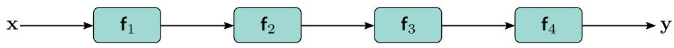

Figure 11.1 Sequential processing. Standard neural networks pass the output ofeach layer directly into the next layer.

Since the processing is sequential, we can equivalently think of this network as aseries of nested functions:

$$
\mathbf {y} = \mathbf {f} _ {4} \left[ \mathbf {f} _ {3} \left[ \mathbf {f} _ {2} \left[ \mathbf {f} _ {1} [ \mathbf {x}, \phi_ {1} ], \phi_ {2} \right], \phi_ {3} \right], \phi_ {4} \right]. \tag {11.2}
$$

# 11.1.1 Limitations of sequential processing

In principle, we can add as many layers as we want, and in the previous chapter, we sawthat adding more layers to a convolutional network does improve performance; the VGGnetwork (figure 10.17), which has eighteen layers, outperforms AlexNet (figure 10.16),which has eight layers. However, image classification performance decreases again asfurther layers are added (figure 11.2). This is surprising since models generally performbetter as more capacity is added (figure 8.10). Indeed, the decrease is present for both thetraining set and the test set, which implies that the problem is training deeper networksrather than the inability of deeper networks to generalize.

This phenomenon is not completely understood. One conjecture is that at initial-ization, the loss gradients change unpredictably when we modify parameters in earlynetwork layers. With appropriate initialization of the weights (see section 7.5), the gra-dient of the loss with respect to these parameters will be reasonable (i.e., no explodingor vanishing gradients). However, the derivative assumes an infinitesimal change in theparameter, whereas optimization algorithms use a finite step size. Any reasonable choiceof step size may move to a place with a completely different and unrelated gradient; theloss surface looks like an enormous range of tiny mountains rather than a single smoothstructure that is easy to descend. Consequently, the algorithm doesn’t make progress inthe way that it does when the loss function gradient changes more slowly.

This conjecture is supported by empirical observations of gradients in networks witha single input and output. For a shallow network, the gradient of the output with re-spect to the input changes slowly as we change the input (figure 11.3a). However, for adeep network, a tiny change in the input results in a completely different gradient (fig-ure 11.3b). This is captured by the autocorrelation function of the gradient (figure 11.3c).Nearby gradients are correlated for shallow networks, but this correlation quickly dropsto zero for deep networks. This is termed the shattered gradients phenomenon.

Shattered gradients presumably arise because changes in early network layers modifythe output in an increasingly complex way as the network becomes deeper. The derivativeof the output $\mathbf { y }$ with respect to the first layer $\mathbf { f } _ { 1 }$ of the network in equation 11.1 is:

$$
\frac {\partial \mathbf {y}}{\partial \mathbf {f} _ {1}} = \frac {\partial \mathbf {f} _ {4}}{\partial \mathbf {f} _ {3}} \frac {\partial \mathbf {f} _ {3}}{\partial \mathbf {f} _ {2}} \frac {\partial \mathbf {f} _ {2}}{\partial \mathbf {f} _ {1}}. \tag {11.3}
$$

When we change the parameters that determine $\mathbf { f } _ { 1 } .$ , all of the derivatives in this sequencecan change since layers $\mathbf { f } _ { 2 } , \mathbf { f } _ { 3 }$ , and $\mathbf { f } _ { 4 }$ are themselves computed from $\mathbf { f } _ { 1 }$ . Consequently,the updated gradient at each training example may be completely different, and the lossfunction becomes badly behaved.1

# 11.2 Residual connections and residual blocks

Residual or skip connections are branches in the computational path, whereby the inputto each network layer f[•] is added back to the output (figure 11.4a). By analogy toequation 11.1, the residual network is defined as:

$$
{\mathbf {h} _ {1}} = {\mathbf {x} + \mathbf {f} _ {1} [ \mathbf {x}, \phi_ {1} ]}
$$

$$
{\bf h} _ {2} = {\bf h} _ {1} + {\bf f} _ {2} [ {\bf h} _ {1}, \phi_ {2} ]
$$

$$
{\bf h} _ {3} = {\bf h} _ {2} + {\bf f} _ {3} [ {\bf h} _ {2}, \phi_ {3} ]
$$

$$
\mathbf {y} = \mathbf {h} _ {3} + \mathbf {f} _ {4} [ \mathbf {h} _ {3}, \phi_ {4} ], \tag {11.4}
$$

where the first term on the right-hand side of each line is the residual connection. Eachfunction ${ \bf f } _ { k }$ learns an additive change to the current representation. It follows that theiroutputs must be the same size as their inputs. Each additive combination of the inputand the processed output is known as a residual block or residual layer.

Once more, we can write this as a single function by substituting in the expressionsfor the intermediate quantities $\mathbf { h } _ { k }$ :

$$
\begin{array}{l} \mathbf {y} = \mathbf {x} + \mathbf {f} _ {1} [ \mathbf {x} ] \tag {11.5} \\ + \mathbf {f} _ {2} [ \mathbf {x} + \mathbf {f} _ {1} [ \mathbf {x} ] ] \\ + \mathbf {f} _ {3} \left[ \mathbf {x} + \mathbf {f} _ {1} [ \mathbf {x} ] + \mathbf {f} _ {2} \left[ \mathbf {x} + \mathbf {f} _ {1} [ \mathbf {x} ] \right] \right] \\ + \mathbf {f} _ {4} \left[ \mathbf {x} + \mathbf {f} _ {1} [ \mathbf {x} ] + \mathbf {f} _ {2} [ \mathbf {x} + \mathbf {f} _ {1} [ \mathbf {x} ] ] + \mathbf {f} _ {3} \left[ \mathbf {x} + \mathbf {f} _ {1} [ \mathbf {x} ] + \mathbf {f} _ {2} [ \mathbf {x} + \mathbf {f} _ {1} [ \mathbf {x} ] ] \right] \right], \\ \end{array}
$$

where we have omitted the parameters $\phi _ { \bullet }$ for clarity. We can think of this equation as“unraveling” the network (figure 11.4b). We see that the final network output is a sumof the input and four smaller networks, corresponding to each line of the equation; one

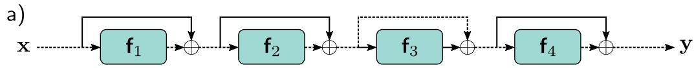

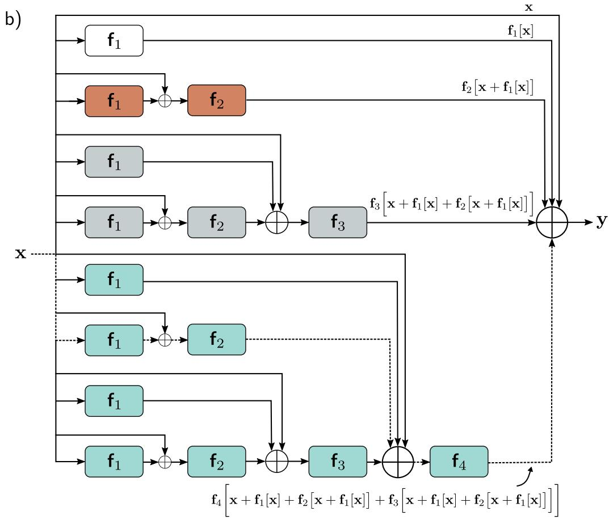

Figure 11.4 Residual connections. a) The output of each function $\mathbf { f } _ { k } [ \mathbf { x } , \phi _ { k } ]$ isadded back to its input, which is passed via a parallel computational path calleda residual or skip connection. Hence, the function computes an additive changeto the representation. b) Upon expanding (unraveling) the network equations, wefind that the output is the sum of the input plus four smaller networks (depictedin white, orange, gray, and cyan, respectively, and corresponding to terms inequation 11.5); we can think of this as an ensemble of networks. Moreover,the output from the cyan network is itself a transformation $\mathbf { f } _ { 4 } [ \bullet , \phi _ { 4 } ]$ of anotherensemble, and so on. Alternatively, we can consider the network as a combinationof 16 different paths through the computational graph. One example is the dashedpath from input x to output y, which is the same in panels (a) and (b).

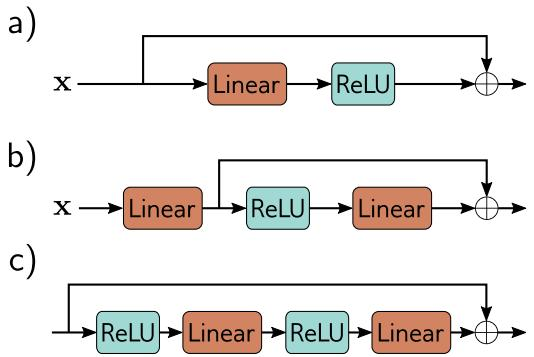

Figure 11.5 Order of operations in resid-ual blocks. a) The usual order of lineartransformation or convolution followedby a ReLU nonlinearity means that eachresidual block can only add non-negativequantities. b) With the reverse order,both positive and negative quantities canbe added. However, we must add a lineartransformation at the start of the net-work in case the input is all negative. c)In practice, it’s common for a residualblock to contain several network layers.

interpretation is that residual connections turn the original network into an ensemble ofthese smaller networks whose outputs are summed to compute the result.

A complementary way of thinking about this residual network is that it creates sixteenpaths of different lengths from input to output. For example, the first function $\mathbf { f } _ { 1 } \left[ \mathbf { x } \right]$occurs in eight of these sixteen paths, including as a direct additive term (i.e., a pathlength of one), and the analogous derivative to equation 11.3 is:

$$
\frac {\partial \mathbf {y}}{\partial \mathbf {f} _ {1}} = \mathbf {I} + \frac {\partial \mathbf {f} _ {2}}{\partial \mathbf {f} _ {1}} + \left(\frac {\partial \mathbf {f} _ {3}}{\partial \mathbf {f} _ {1}} + \frac {\partial \mathbf {f} _ {3}}{\partial \mathbf {f} _ {2}} \frac {\partial \mathbf {f} _ {2}}{\partial \mathbf {f} _ {1}}\right) + \left(\frac {\partial \mathbf {f} _ {4}}{\partial \mathbf {f} _ {1}} + \frac {\partial \mathbf {f} _ {4}}{\partial \mathbf {f} _ {2}} \frac {\partial \mathbf {f} _ {2}}{\partial \mathbf {f} _ {1}} + \frac {\partial \mathbf {f} _ {4}}{\partial \mathbf {f} _ {3}} \frac {\partial \mathbf {f} _ {3}}{\partial \mathbf {f} _ {1}} + \frac {\partial \mathbf {f} _ {4}}{\partial \mathbf {f} _ {3}} \frac {\partial \mathbf {f} _ {3}}{\partial \mathbf {f} _ {2}} \frac {\partial \mathbf {f} _ {2}}{\partial \mathbf {f} _ {1}}\right), (1 1. 6)
$$

where there is one term for each of the eight paths. The identity term on the right-hand side shows that changes in the parameters $\phi _ { 1 }$ in the first layer $\mathbf { f } _ { 1 } [ \mathbf { x } , \phi _ { 1 } ]$ contributedirectly to changes in the network output y. They also contribute indirectly throughthe other chains of derivatives of varying lengths. In general, gradients through shorterpaths will be better behaved. Since both the identity term and various short chains ofderivatives will contribute to the derivative for each layer, networks with residual linkssuffer less from shattered gradients.

Problem 11.2

Problem 11.3

Notebook 11.2Residualnetworks

# 11.2.1 Order of operations in residual blocks

Until now, we have implied that the additive functions f[x] could be any valid networklayer (e.g., fully connected or convolutional). This is technically true, but the order ofoperations in these functions is important. They must contain a nonlinear activationfunction like a ReLU, or the entire network will be linear. However, in a typical networklayer (figure 11.5a), the ReLU function is at the end, so the output is non-negative. Ifwe adopt this convention, then each residual block can only increase the input values.

Hence, it is typical to change the order of operations so that the activation function isapplied first, followed by the linear transformation (figure 11.5b). Sometimes there maybe several layers of processing within the residual block (figure 11.5c), but these usuallyterminate with a linear transformation. Finally, we note that when we start these blockswith a ReLU operation, they will do nothing if the initial network input is negative sincethe ReLU will clip the entire signal to zero. Hence, it’s typical to start the network witha linear transformation rather than a residual block, as in figure 11.5b.

# 11.2.2 Deeper networks with residual connections

Adding residual connections roughly doubles the depth of a network that can be practi-cally trained before performance degrades. However, we would like to increase the depthfurther. To understand why residual connections do not allow us to increase the deptharbitrarily, we must consider how the variance of the activations changes during theforward pass and how the gradient magnitudes change during the backward pass.

# 11.3 Exploding gradients in residual networks

In section 7.5, we saw that initializing the network parameters is critical. Withoutcareful initialization, the magnitudes of the intermediate values during the forward passof backpropagation can increase or decrease exponentially. Similarly, the gradients duringthe backward pass can explode or vanish as we move backward through the network.

Hence, we initialize the network parameters so that the expected variance of theactivations (in the forward pass) and gradients (in the backward pass) remains the samebetween layers. He initialization (section 7.5) achieves this for ReLU activations byinitializing the biases $\beta$ to zero and choosing normally distributed weights Ω with meanzero and variance $2 / D _ { h }$ where $D _ { h }$ is the number of hidden units in the previous layer.

Now consider a residual network. We do not have to worry about the intermediatevalues or gradients vanishing with network depth since there exists a path wherebyeach layer directly contributes to the network output (equation 11.5 and figure 11.4b).However, even if we use He initialization within the residual block, the values in theforward pass increase exponentially as we move through the network.

To see why, consider that we add the result of the processing in the residual block backto the input. Each branch has some (uncorrelated) variability. Hence, the overall varianceincreases when we recombine them. With ReLU activations and He initialization, theexpected variance is unchanged by the processing in each block. Consequently, whenwe recombine with the input, the variance doubles (figure 11.6a), growing exponentiallywith the number of residual blocks. This limits the possible network depth before floatingpoint precision is exceeded in the forward pass. A similar argument applies to thegradients in the backward pass of the backpropagation algorithm.

Hence, residual networks still suffer from unstable forward propagation and explodinggradients even with He initialization. One approach that would stabilize the forward andbackward passes would be to use He initialization and then multiply the combined output√of each residual block by $1 / \sqrt { 2 }$ to compensate for the doubling (figure 11.6b). However,it is more usual to use batch normalization.

# 11.4 Batch normalization

Batch normalization or BatchNorm shifts and rescales each activation h so that its meanand variance across the batch B become values that are learned during training. First,the empirical mean $m _ { h }$ and standard deviation $s _ { h }$ are computed:

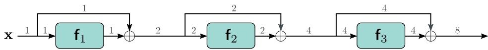

b)

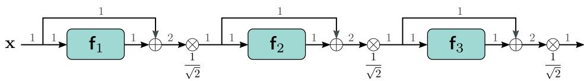

c)

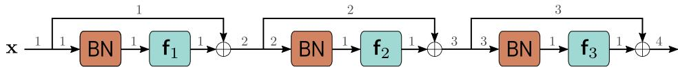

Figure 11.6 Variance in residual networks. a) He initialization ensures that theexpected variance remains unchanged after a linear plus ReLU layer $\mathbf { f } _ { k } .$ Unfortu-nately, in residual networks, the input of each block is added back to the output,so the variance doubles at each layer (gray numbers indicate variance) and growsexponentially. b) One approach would be to rescale the signal by $1 / \sqrt { 2 }$ betweeneach residual block. c) A second method uses batch normalization (BN) as thefirst step in the residual block and initializes the associated offset δ to zero andscale γ to one. This transforms the input to each layer to have unit variance, andwith He initialization, the output variance will also be one. Now the varianceincreases linearly with the number of residual blocks. A side-effect is that, atinitialization, later network layers are dominated by the residual connection andare hence close to computing the identity.

$$
m _ {h} = \frac {1}{| \mathcal {B} |} \sum_ {i \in \mathcal {B}} h _ {i}
$$

$$
s _ {h} = \sqrt {\frac {1}{| \mathcal {B} |} \sum_ {i \in \mathcal {B}} (h _ {i} - m _ {h}) ^ {2}}, \tag {11.7}
$$

where all quantities are scalars. Then we use these statistics to standardize the batchactivations to have mean zero and unit variance:

$$
h _ {i} \leftarrow \frac {h _ {i} - m _ {h}}{s _ {h} + \epsilon} \quad \forall i \in \mathcal {B}, \tag {11.8}
$$

where ϵ is a small number that prevents division by zero if $h _ { i }$ is the same for everymember of the batch and $s _ { h } = 0$ .

Finally, the normalized variable is scaled by $\gamma$ and shifted by δ:

$$
h _ {i} \leftarrow \gamma h _ {i} + \delta \quad \forall i \in \mathcal {B}. \tag {11.9}
$$

Appendix C.2.4Standardization

Problem 11.5

Problem 11.6

Notebook 11.3BatchNorm

After this operation, the activations have mean $\delta$ and standard deviation $\gamma$ across allmembers of the batch. Both of these quantities are learned during training.

Batch normalization is applied independently to each hidden unit. In a standardneural network with K layers, each containing D hidden units, there would be KDlearned offsets δ and KD learned scales γ. In a convolutional network, the normalizingstatistics are computed over both the batch and the spatial position. If there were $K$layers, each containing C channels, there would be $K C$ offsets and $K C$ scales. At testtime, we do not have a batch from which we can gather statistics. To resolve this, thestatistics $m _ { h }$ and $s _ { h }$ are calculated across the whole training dataset (rather than just abatch) and frozen in the final network.

# 11.4.1 Costs and benefits of batch normalization

Batch normalization makes the network invariant to rescaling the weights and biases thatcontribute to each activation; if these are doubled, then the activations also double, theestimated standard deviation $s _ { h }$ doubles, and the normalization in equation 11.8 com-pensates for these changes. This happens separately for each hidden unit. Consequently,there will be a large family of weights and biases that all produce the same effect. Batchnormalization also adds two parameters, γ and δ, at every hidden unit, which makes themodel somewhat larger. Hence, it both creates redundancy in the weight parameters andadds extra parameters to compensate for that redundancy. This is obviously inefficient,but batch normalization also provides several benefits.

Stable forward propagation: If we initialize the offsets δ to zero and the scales $\gamma$ to one,then each output activation will have unit variance. In a regular network, this ensuresthe variance is stable during forward propagation at initialization. In a residual network,the variance must still increase as we add a new source of variation to the input at eachlayer. However, it will increase linearly with each residual block; the $k ^ { t h }$ layer adds oneunit of variance to the existing variance of k (figure 11.6c).

At initialization, this has the side-effect that later layers make a smaller change tothe overall variation than earlier ones. The network is effectively less deep at the start oftraining since later layers are close to computing the identity. As training proceeds, thenetwork can increase the scales γ in later layers and can control its own effective depth.

Higher learning rates: Empirical studies and theory both show that batch normaliza-tion makes the loss surface and its gradient change more smoothly (i.e., reduces shat-tered gradients). This means we can use higher learning rates as the surface is morepredictable. We saw in section 9.2 that higher learning rates improve test performance.

Regularization: We also saw in chapter 9 that adding noise to the training processcan improve generalization. Batch normalization injects noise because the normaliza-tion depends on the batch statistics. The activations for a given training example arenormalized by an amount that depends on the other members of the batch and will beslightly different at each training iteration.

# 11.5 Common residual architectures

Residual connections are now a standard part of deep learning pipelines. This sectionreviews some well-known architectures that incorporate them.

# 11.5.1 ResNet

Residual blocks were first used in convolutional networks for image classification. Theresulting networks are known as residual networks, or ResNets for short. In ResNets, eachresidual block contains a batch normalization operation, a ReLU activation function, anda convolutional layer. This is followed by the same sequence again before being addedback to the input (figure 11.7a). Trial and error have shown that this order of operationsworks well for image classification.

For very deep networks, the number of parameters may become undesirably large.Bottleneck residual blocks make more efficient use of parameters using three convolutions.The first has a 1×1 kernel and reduces the number of channels. The second is a regular3×3 kernel, and the third is another 1×1 kernel to increase the number of channels backto the original amount (figure 11.7b). In this way, we can integrate information over a3×3 pixel area using fewer parameters.

The ResNet-200 model (figure 11.8) contains 200 layers and was used for image clas-sification on the ImageNet database (figure 10.15). The architecture resembles AlexNetand VGG but uses bottleneck residual blocks instead of vanilla convolutional layers. Aswith AlexNet and VGG, these are periodically interspersed with decreases in spatialresolution and simultaneous increases in the number of channels. Here, the resolution isdecreased by downsampling using convolutions with stride two. The number of channelsis increased either by appending zeros to the representation or by using an extra 1×1convolution. At the start of the network is a 7×7 convolutional layer, followed by adownsampling operation. At the end, a fully connected layer maps the block to a vectorof length 1000. This is passed through a softmax layer to generate class probabilities.

The ResNet-200 model achieved a remarkable 4.8% error rate for the correct classbeing in the top five and 20.1% for identifying the correct class correctly. This comparedfavorably with AlexNet (16.4%, 38.1%) and VGG (6.8%, 23.7%) and was one of thefirst networks to exceed human performance (5.1% for being in the top five guesses).However, this model was conceived in 2016 and is far from state-of-the-art. At the timeof writing, the best-performing model on this task has a 9.0% error for identifying theclass correctly (see figure 10.21). This and all the other current top-performing modelsfor image classification are now based on transformers (see chapter 12).

# 11.5.2 DenseNet

Residual blocks receive the output from the previous layer, modify it by passing itthrough some network layers, and add it back to the original input. An alternative isto concatenate the modified and original signals. This increases the representation size

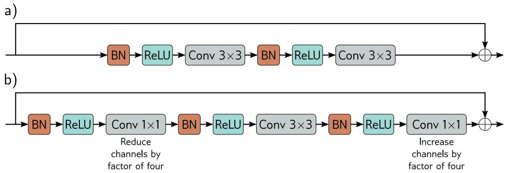

Figure 11.7 ResNet blocks. a) A standard block in the ResNet architecture con-tains a batch normalization operation, followed by an activation function, anda 3×3 convolutional layer. Then, this sequence is repeated. b). A bottleneckResNet block still integrates information over a 3×3 region but uses fewer pa-rameters. It contains three convolutions. The first 1×1 convolution reduces thenumber of channels. The second 3×3 convolution is applied to the smaller rep-resentation. A final 1×1 convolution increases the number of channels again sothat it can be added back to the input.

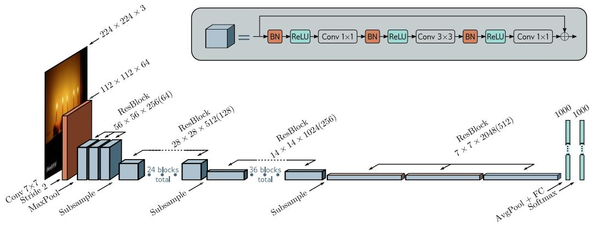

Figure 11.8 ResNet-200 model. A standard 7×7 convolutional layer with stridetwo is applied, followed by a MaxPool operation. A series of bottleneck residualblocks follow (number in brackets is channels after first 1×1 convolution), withperiodic downsampling and accompanying increases in the number of channels.The network concludes with average pooling across all spatial positions and afully connected layer that maps to pre-softmax activations.

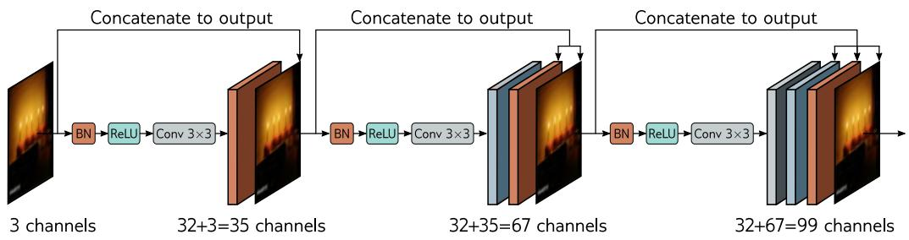

Figure 11.9 DenseNet. This architecture uses residual connections to concatenatethe outputs of earlier layers to later ones. Here, the three-channel input image isprocessed to form a 32-channel representation. The input image is concatenatedto this to give a total of 35 channels. This combined representation is processedto create another 32-channel representation, and both earlier representations areconcatenated to this to create a total of 67 channels and so on.

(in terms of channels for a convolutional network), but an optional subsequent lineartransformation can map back to the original size (a 1×1 convolution for a convolutionalnetwork). This allows the model to add the representations together, take a weightedsum, or combine them in a more complex way.

The DenseNet architecture uses concatenation so that the input to a layer comprisesthe concatenated outputs from all previous layers (figure 11.9). These are processed tocreate a new representation that is itself concatenated with the previous representationand passed to the next layer. This concatenation means there is a direct contributionfrom earlier layers to the output, so the loss surface behaves reasonably.

In practice, this can only be sustained for a few layers because the number of channels(and hence the number of parameters required to process them) becomes increasinglylarge. This problem can be alleviated by applying a 1×1 convolution to reduce thenumber of channels before the next 3×3 convolution is applied. In a convolutionalnetwork, the input is periodically downsampled. Concatenation across the downsamplingmakes no sense since the representations have different sizes. Consequently, the chain ofconcatenation is broken at this point, and a smaller representation starts a new chain.In addition, another bottleneck 1×1 convolution can be applied when the downsamplingoccurs to control the representation size further.

This network performs competitively with ResNet models on image classification (seefigure 10.21); indeed, it can perform better for a comparable parameter count. This ispresumably because it can reuse processing from earlier layers more flexibly.

# 11.5.3 U-Nets and hourglass networks

Section 10.5.3 described a semantic segmentation network that had an encoder-decoder orhourglass structure. The encoder repeatedly downsamples the image until the receptivefields are large and information is integrated from across the image. Then the decoderupsamples it back to the size of the original image. The final output is a probabilityover possible object classes at each pixel. One drawback of this architecture is thatthe low-resolution representation in the middle of the network must “remember” thehigh-resolution details to make the final result accurate. This is unnecessary if residualconnections transfer the representations from the encoder to their partner in the decoder.

The U-Net (figure 11.10) is an encoder-decoder architecture where the earlier repre-sentations are concatenated to the later ones. The original implementation used “valid”convolutions, so the spatial size decreases by two pixels each time a 3×3 convolutionallayer is applied. This means that the upsampled version is smaller than its counterpartin the encoder, which must be cropped before concatenation. Subsequent implementa-tions have used zero padding, where this cropping is unnecessary. Note that the U-Netis completely convolutional, so after training, it can be run on an image of any size.

The U-Net was intended for segmenting medical images (figure 11.11) but has foundmany other uses in computer graphics and vision. Hourglass networks are similar butapply further convolutional layers in the skip connections and add the result back to thedecoder rather than concatenating it. A series of these models form a stacked hourglassnetwork that alternates between considering the image at local and global levels. Suchnetworks are used for pose estimation (figure 11.12). The system is trained to predict one“heatmap” for each joint, and the estimated position is the maximum of each heatmap.

Problem 11.9

a)

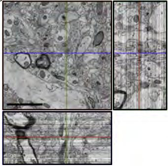

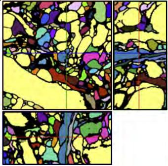

c)

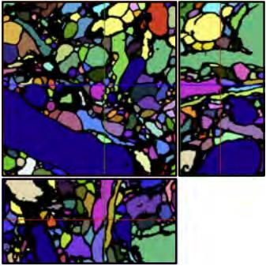

Figure 11.11 Segmentation using U-Net in 3D. a) Three slices through a 3Dvolume of mouse cortex taken by scanning electron microscope. b) A single U-Net is used to classify voxels as being inside or outside neurites. Connectedregions are identified with different colors. c) For a better result, an ensemble offive U-Nets is trained, and a voxel is only classified as belonging to the cell if allfive networks agree. Adapted from Falk et al. (2019).

# 11.6 Why do nets with residual connections perform so well?

Residual networks allow much deeper networks to be trained; it’s possible to extend theResNet architecture to 1000 layers and still train effectively. The improvement in imageclassification performance was initially attributed to the additional network depth, buttwo pieces of evidence contradict this viewpoint.

First, shallower, wider residual networks sometimes outperform deeper, narrower oneswith a comparable parameter count. In other words, better performance can sometimesbe achieved with a network with fewer layers but more channels per layer. Second, thereis evidence that the gradients during training do not propagate effectively through verylong paths in the unraveled network (figure 11.4b). In effect, a very deep network mayact more like a combination of shallower networks.

The current view is that residual connections add some value of their own, as wellas allowing deeper networks to be trained. This perspective is supported by the factthat the loss surfaces of residual networks around a minimum tend to be smoother andmore predictable than those for the same network when the skip connections are removed(figure 11.13). This may make it easier to learn a good solution that generalizes well.

# 11.7 Summary

Increasing network depth indefinitely causes both training and test performance for imageclassification to decrease. This may be because the gradient of the loss with respect to

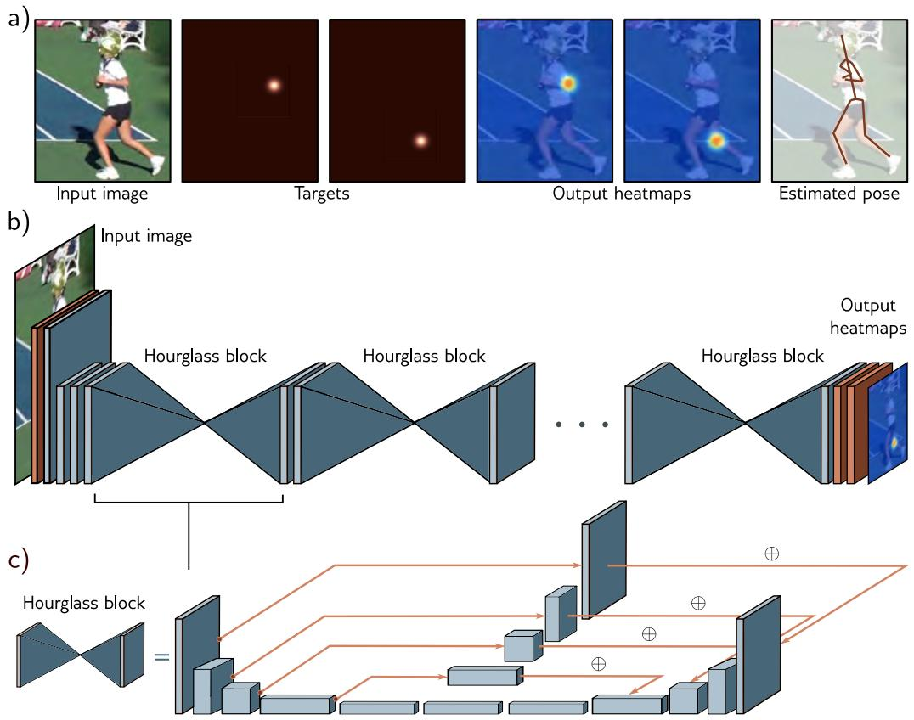

Figure 11.12 Stacked hourglass networks for pose estimation. a) The networkinput is an image containing a person, and the output is a set of heatmaps, withone heatmap for each joint. This is formulated as a regression problem where thetargets are heatmap images with small, highlighted regions at the ground-truthjoint positions. The peak of the estimated heatmap is used to establish each finaljoint position. b) The architecture consists of initial convolutional and residuallayers followed by a series of hourglass blocks. c) Each hourglass block consistsof an encoder-decoder network similar to the U-Net except that the convolutionsuse zero padding, some further processing is done in the residual links, and theselinks add this processed representation rather than concatenate it. Each bluecuboid is itself a bottleneck residual block (figure 11.7b). Adapted from Newellet al. (2016).

a)

Residualconnections

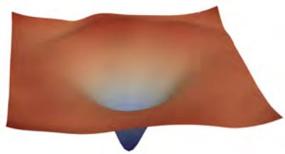

b)

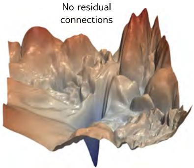

Figure 11.13 Visualizing neural network loss surfaces. Each plot shows the losssurface in two random directions in parameter space around the minimum foundby SGD for an image classification task on the CIFAR-10 dataset. These direc-tions are normalized to facilitate side-by-side comparison. a) Residual net with 56layers. b) Results from the same network without skip connections. The surfaceis smoother with the skip connections. This facilitates learning and makes thefinal network performance more robust to minor errors in the parameters, so itwill likely generalize better. Adapted from Li et al. (2018b).

parameters early in the network changes quickly and unpredictably relative to the updatestep size. Residual connections add the processed representation back to their own input.Now each layer contributes directly to the output as well as indirectly, so propagatinggradients through many layers is not mandatory, and the loss surface is smoother.

Residual networks don’t suffer from vanishing gradients but introduce an exponentialincrease in the variance of the activations during forward propagation and correspondingproblems with exploding gradients. This is usually handled by adding batch normaliza-tion, which compensates for the empirical mean and variance of the batch and thenshifts and rescales using learned parameters. If these parameters are initialized judi-ciously, very deep networks can be trained. There is evidence that both residual linksand batch normalization make the loss surface smoother, which permits larger learningrates. Moreover, the variability in the batch statistics adds a source of regularization.

Residual blocks have been incorporated into convolutional networks. They allowdeeper networks to be trained with commensurate increases in image classification per-formance. Variations of residual networks include the DenseNet architecture, whichconcatenates outputs of all prior layers to feed into the current layer, and U-Nets, whichincorporate residual connections into encoder-decoder models.

# Notes

Residual connections: Residual connections were introduced by He et al. (2016a), who builta network with 152 layers, which was eight times larger than VGG (figure 10.17), and achievedstate-of-the-art performance on the ImageNet classification task. Each residual block consistedof a convolutional layer followed by batch normalization, a ReLU activation, a second convolu-tional layer, and second batch normalization. A second ReLU function was applied after thisblock was added back to the main representation. This architecture was termed ResNet v1.He et al. (2016b) investigated different variations of residual architectures, in which either (i)processing could also be applied along the skip connection or (ii) after the two branches hadrecombined. They concluded neither was necessary, leading to the architecture in figure 11.7,which is sometimes termed a pre-activation residual block and is the backbone of ResNet v2.They trained a network with 200 layers that improved further on the ImageNet classificationtask (see figure 11.8). Since this time, new methods for regularization, optimization, and dataaugmentation have been developed, and Wightman et al. (2021) exploit these to present a moremodern training pipeline for the ResNet architecture.

Why residual connections help: Residual networks certainly allow deeper networks to betrained. Presumably, this is related to reducing shattered gradients (Balduzzi et al., 2017) atthe start of training and the smoother loss surface near the minima as depicted in figure 11.13(Li et al., 2018b). Residual connections alone (i.e., without batch normalization) increase thetrainable depth of a network by roughly a factor of two (Sankararaman et al., 2020). With batchnormalization, very deep networks can be trained, but it is unclear that depth is critical forperformance. Zagoruyko & Komodakis (2016) showed that wide residual networks with only 16layers outperformed all residual networks of the time for image classification. Orhan & Pitkow(2017) propose a different explanation for why residual connections improve learning in termsof eliminating singularities (places on the loss surface where the Hessian is degenerate).

Related architectures: Residual connections are a special case of highway networks (Srivas-tava et al., 2015) which also split the computation into two branches and additively recombine.Highway networks use a gating function that weights the inputs to the two branches in a waythat depends on the data itself, whereas residual networks send the data down both branches ina straightforward manner. Xie et al. (2017) introduced the ResNeXt architecture, which placesa residual connection around multiple parallel convolutional branches.

Residual networks as ensembles: Veit et al. (2016) characterized residual networks as en-sembles of shorter networks and depicted the “unraveled network” interpretation (figure 11.4b).They provide evidence that this interpretation is valid by showing that deleting layers in atrained network (and hence a subset of paths) only has a modest effect on performance. Con-versely, removing a layer in a purely sequential network like VGG is catastrophic. They alsolooked at the gradient magnitudes along paths of different lengths and showed that the gradientvanishes in longer paths. In a residual network consisting of 54 blocks, almost all of the gradientupdates during training were from paths of length 5 to 17 blocks long, even though these onlyconstitute 0.45% of the total paths. It seems that adding more blocks effectively adds moreparallel shorter paths rather than creating a network that is truly deeper.

Regularization for residual networks: L2 regularization of the weights has a fundamentallydifferent effect in vanilla networks and residual networks without BatchNorm. In the former, itencourages the output of the layer to be a constant function determined by the biases. In thelatter, it encourages the residual block to compute the identity plus a constant determined bythe biases.

Several regularization methods have been developed that are targeted specifically at residualarchitectures. ResDrop (Yamada et al., 2016), stochastic depth (Huang et al., 2016), andRandomDrop (Yamada et al., 2019) all regularize residual networks by randomly droppingresidual blocks during the training process. In the latter case, the propensity for dropping a blockis determined by a Bernoulli variable, whose parameter is linearly decreased during training. Attest time, the residual blocks are added back in with their expected probability. These methodsare effectively versions of dropout, in which all the hidden units in a block are simultaneouslydropped in concert. In the multiple paths view of residual networks (figure 11.4b), they simplyremove some of the paths at each training step. Wu et al. (2018b) developed BlockDrop, whichanalyzes an existing network and decides which residual blocks to use at runtime with the goalof improving the efficiency of inference.

Other regularization methods have been developed for networks with multiple paths insidethe residual block. Shake-shake (Gastaldi, 2017a,b) randomly re-weights the paths during theforward and backward passes. In the forward pass, this can be viewed as synthesizing randomdata, and in the backward pass, as injecting another form of noise into the training method.ShakeDrop (Yamada et al., 2019) draws a Bernoulli variable that decides whether each blockwill be subject to Shake-Shake or behave like a standard residual unit on this training step.

Batch normalization: Batch normalization was introduced by Ioffe & Szegedy (2015) outsideof the context of residual networks. They showed empirically that it allowed higher learningrates, increased convergence speed, and made sigmoid activation functions more practical (sincethe distribution of outputs is controlled, so examples are less likely to fall in the saturatedextremes of the sigmoid). Balduzzi et al. (2017) investigated the activation of hidden units inlater layers of deep networks with ReLU functions at initialization. They showed that many suchhidden units were always active or always inactive regardless of the input but that BatchNormreduced this tendency.

Although batch normalization helps stabilize the forward propagation of signals through anetwork, Yang et al. (2019) showed that it causes gradient explosion in ReLU networks withoutskip connections, with each layer increasing the magnitude of the gradients by $\sqrt { \pi / ( \pi - 1 ) }$ ≈1.21. This argument is summarized by Luther (2020). Since a residual network can be seenas a combination of paths of different lengths (figure 11.4), this effect must also be present inresidual networks. Presumably, however, the benefit of removing the $2 ^ { K }$ increases in magnitudein the forward pass of a network with K layers outweighs the harm done by increasing thegradients by $1 . 2 \dot { 1 } ^ { K }$ in the backward pass, so overall BatchNorm makes training more stable.

Variations of batch normalization: Several variants of BatchNorm have been proposed(figure 11.14). BatchNorm normalizes each channel separately based on statistics gatheredacross the batch. Ghost batch normalization or GhostNorm (Hoffer et al., 2017) uses only partof the batch to compute the normalization statistics, which makes them noisier and increasesthe amount of regularization when the batch size is very large (figure 11.14b).

When the batch size is very small or the fluctuations within a batch are very large (as is often thecase in natural language processing), the statistics in BatchNorm may become unreliable. Ioffe(2017) proposed batch renormalization, which keeps a running average of the batch statisticsand modifies the normalization of any batch to ensure that it is more representative. Anotherproblem is that batch normalization is unsuitable for use in recurrent neural networks (networksfor processing sequences, in which the previous output is fed back as an additional input as wemove through the sequence (see figure 12.19). Here, the statistics must be stored at each step inthe sequence, and it’s unclear what to do if a test sequence is longer than the training sequences.A third problem is that batch normalization needs access to the whole batch. However, thismay not be easily available when training is distributed across several machines.

Layer normalization or LayerNorm (Ba et al., 2016) avoids using batch statistics by normalizingeach data example separately, using statistics gathered across the channels and spatial position(figure 11.14c). However, there is still a separate learned scale γ and offset δ per channel.Group normalization or GroupNorm (Wu & He, 2018) is similar to LayerNorm but divides thechannels into groups and computes the statistics for each group separately across the within-group channels and the spatial positions (figure 11.14d). Again, there are still separate scale andoffset parameters per channel. Instance normalization or InstanceNorm (Ulyanov et al., 2016)takes this to the extreme where the number of groups is the same as the number of channels,so each channel is normalized separately (figure 11.14e), using statistics gathered across spatialposition alone. Salimans & Kingma (2016) investigated normalizing the network weights ratherthan the activations, but this has been less empirically successful. Teye et al. (2018) introducedMonte Carlo batch normalization, which can provide meaningful estimates of uncertainty in thepredictions of neural networks. A recent comparison of the properties of different normalizationschemes can be found in Lubana et al. (2021).

a)

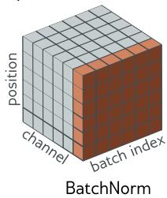

b)

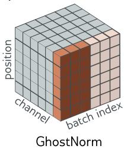

c

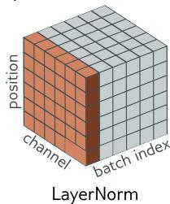

e)

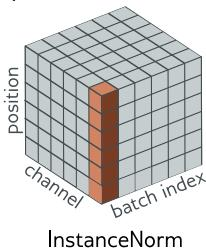

Figure 11.14 Normalization schemes. BatchNorm modifies each channel sepa-rately but adjusts each batch member in the same way based on statistics gath-ered across the batch and spatial position. Ghost BatchNorm computes thesestatistics from only part of the batch to make them more variable. LayerNormcomputes statistics for each batch member separately, based on statistics gath-ered across the channels and spatial position. It retains a separate learned scalingfactor for each channel. GroupNorm normalizes within each group of channelsand also retains a separate scale and offset parameter for each channel. Instan-ceNorm normalizes within each channel separately, computing the statistics onlyacross spatial position. Adapted from Wu & He (2018).

Why BatchNorm helps: BatchNorm helps control the initial gradients in a residual network(figure 11.6c). However, the mechanism by which BatchNorm improves performance is notwell understood. The stated goal of Ioffe & Szegedy (2015) was to reduce problems causedby internal covariate shift, which is the change in the distribution of inputs to a layer causedby updating preceding layers during the backpropagation update. However, Santurkar et al.(2018) provided evidence against this view by artificially inducing covariate shift and showingthat networks with and without BatchNorm performed equally well.

Motivated by this, they searched for another explanation for why BatchNorm should improveperformance. They showed empirically for the VGG network that adding batch normalizationdecreases the variation in both the loss and its gradient as we move in the gradient direction.In other words, the loss surface is both smoother and changes more slowly, which is why largerlearning rates are possible. They also provide theoretical proofs for both these phenomenaand show that for any parameter initialization, the distance to the nearest optimum is less fornetworks with batch normalization. Bjorck et al. (2018) also argue that BatchNorm improvesthe properties of the loss landscape and allows larger learning rates.

Other explanations of why BatchNorm improves performance include decreasing the importanceof tuning the learning rate (Ioffe & Szegedy, 2015; Arora et al., 2018). Indeed Li & Arora(2019) show that using an exponentially increasing learning rate schedule is possible with batchnormalization. Ultimately, this is because batch normalization makes the network invariant tothe scales of the weight matrices (see Huszár, 2019, for an intuitive visualization).

Hoffer et al. (2017) identified that BatchNorm has a regularizing effect due to statistical fluc-tuations from the random composition of the batch. They proposed using a ghost batch size,in which the mean and standard deviation statistics are computed from a subset of the batch.Large batches can now be used without losing the regularizing effect of the extra noise in smallerbatch sizes. Luo et al. (2018) investigate the regularization effects of batch normalization.

Alternatives to batch normalization: Although BatchNorm is widely used, it is not strictlynecessary to train deep residual nets; there are other ways of making the loss surface tractable.Balduzzi et al. (2017) proposed the rescaling by $\sqrt { 1 / 2 }$ in figure 11.6b; they argued that itprevents gradient explosion but does not resolve the problem of shattered gradients.

Other work has investigated rescaling the function’s output in the residual block before addingit back to the input. For example, De & Smith (2020) introduce SkipInit, in which a learnablescalar multiplier is placed at the end of each residual branch. This helps if this multiplier isinitialized to less than ${ \sqrt { 1 / K } } ,$ , where K is the number of residual blocks. In practice, theysuggest initializing this to zero. Similarly, Hayou et al. (2021) introduce Stable ResNet, whichrescales the output of the function in the $k ^ { t h }$ residual block (before addition to the main branch)by a constant $\lambda _ { k } .$ They prove that in the limit of infinite width, the expected gradient norm ofthe weights in the first layer is lower bounded by the sum of squares of the scalings $\lambda _ { k }$ . Theyinvestigate setting these to a constant $\sqrt { 1 / K }$ , where K is the number of residual blocks andshow that it is possible to train networks with up to 1000 blocks.

Zhang et al. (2019a) introduce $F i x U p ,$ in which every layer is initialized using He normalization,but the last linear/convolutional layer of every residual block is set to zero. Now the initialforward pass is stable (since each residual block contributes nothing), and the gradients do notexplode in the backward pass (for the same reason). They also rescale the branches so that themagnitude of the total expected change in the parameters is constant regardless of the numberof residual blocks. These methods allow training of deep residual networks but don’t usuallyachieve the same test performance as when using BatchNorm. This is probably because theydo not benefit from the regularization induced by the noisy batch statistics. De & Smith (2020)modify their method to induce regularization via dropout, which helps close this gap.

DenseNet and U-Net: DenseNet was first introduced by Huang et al. (2017b), U-Net wasdeveloped by Ronneberger et al. (2015), and stacked hourglass networks by Newell et al. (2016).Of these architectures, U-Net has been the most extensively adapted. Çiçek et al. (2016) in-troduced 3D U-Net, and Milletari et al. (2016) introduced V-Net, both of which extend U-Netto process 3D data. Zhou et al. (2018) combine the ideas of DenseNet and U-Net in an archi-tecture that downsamples and re-upsamples the image but also repeatedly uses intermediaterepresentations. U-Nets are commonly used in medical image segmentation (see Siddique et al.,2021, for a review). However, they have been applied to other areas, including depth estimation(Garg et al., 2016), semantic segmentation (Iglovikov & Shvets, 2018), inpainting (Zeng et al.,2019), pansharpening (Yao et al., 2018), and image-to-image translation (Isola et al., 2017).U-Nets are also a key component in diffusion models (chapter 18).

# Problems

Problem 11.1 Derive equation 11.5 from the network definition in equation 11.4.

Problem 11.2 Unraveling the four-block network in figure 11.4a produces one path of lengthzero, four paths of length one, six paths of length two, four paths of length three, and one pathof length four. How many paths of each length would there be if with (i) three residual blocksand (ii) five residual blocks? Deduce the rule for K residual blocks.

Problem 11.3 Show that the derivative of the network in equation 11.5 with respect to the firstlayer f1[x] is given by equation 11.6.

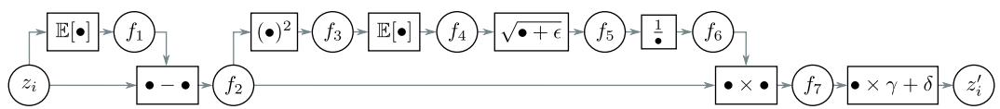

Figure 11.15 Computational graph for batch normalization (see problem 11.5).

Problem 11.4∗ Explain why the values in the two branches of the residual blocks in figure 11.6aare uncorrelated. Show that the variance of the sum of uncorrelated variables is the sum oftheir individual variances.

Problem 11.5∗ The forward pass for batch normalization given a batch of scalar values $\{ z _ { i } \} _ { i = 1 } ^ { I }$consists of the following operations (figure 11.15):

$$
f _ {1} = \mathbb {E} [ z _ {i} ] \quad f _ {5} = \sqrt {f _ {4} + \epsilon}
$$

$$
f _ {2 i} = x _ {i} - f _ {1} \quad f _ {6} = 1 / f _ {5} \tag {11.10}
$$

$$
f _ {3 i} = f _ {2 i} ^ {2} \quad f _ {7 i} = f _ {2 i} \times f _ {6}
$$

$$
f _ {4} = \mathbb {E} [ f _ {3 i} ] \quad z _ {i} ^ {\prime} = f _ {7 i} \times \gamma + \delta ,
$$

where $\begin{array} { r } { \mathbb { E } [ z _ { i } ] ~ = ~ \frac { 1 } { I } \sum _ { i } z _ { i } } \end{array}$ . Write Python code to implement the forward pass. Now derive thealgorithm for the backward pass. Work backward through the computational graph computingthe derivatives to generate a set of operations that computes $\partial z _ { i } ^ { \prime } / \partial z _ { i }$ for every element in thebatch. Write Python code to implement the backward pass.

Problem 11.6 Consider a fully connected neural network with one input, one output, and tenhidden layers, each of which contains twenty hidden units. How many parameters does thisnetwork have? How many parameters will it have if we place a batch normalization operationbetween each linear transformation and ReLU?

Problem 11.7∗ Consider applying an L2 regularization penalty to the weights in the convolu-tional layers in figure 11.7a, but not to the scaling parameters of the subsequent BatchNormlayers. What do you expect will happen as training proceeds?

Problem 11.8 Consider a convolutional residual block that contains a batch normalization oper-ation, followed by a ReLU activation function, and then a 3×3 convolutional layer. If the inputand output both have 512 channels, how many parameters are needed to define this block? Nowconsider a bottleneck residual block that contains three batch normalization/ReLU/convolutionsequences. The first uses a 1×1 convolution to reduce the number of channels from 512 to 128.The second uses a 3×3 convolution with the same number of input and output channels. Thethird uses a 1×1 convolution to increase the number of channels from 128 to 512 (see fig-ure 11.7b). How many parameters are needed to define this block?

Problem 11.9 The U-Net is completely convolutional and can be run with any sized image aftertraining. Why do we not train with a collection of arbitrarily-sized images?