# Chapter 12

# Transformers

Chapter 10 introduced convolutional networks, which are specialized for processing datathat lie on a regular grid. They are particularly suited to processing images, which havea very large number of input variables, precluding the use of fully connected networks.Each layer of a convolutional network employs parameter sharing so that local imagepatches are processed similarly at every position in the image.

This chapter introduces transformers. These were initially targeted at natural lan-guage processing (NLP) problems, where the network input is a series of high-dimensionalembeddings representing words or word fragments. Language datasets share some of thecharacteristics of image data. The number of input variables can be very large, and thestatistics are similar at every position; it’s not sensible to re-learn the meaning of theword dog at every possible position in a body of text. However, language datasets havethe complication that text sequences vary in length, and unlike images, there is no easyway to resize them.

# 12.1 Processing text data

To motivate the transformer, consider the following passage:

The restaurant refused to serve me a ham sandwich because it only cooks vegetarianfood. In the end, they just gave me two slices of bread. Their ambiance was just as goodas the food and service.

The goal is to design a network to process this text into a representation suitable fordownstream tasks. For example, it might be used to classify the review as positive ornegative or to answer questions such as “Does the restaurant serve steak?”.

We can make three immediate observations. First, the encoded input can be surpris-ingly large. In this case, each of the 37 words might be represented by an embeddingvector of length 1024, so the encoded input would be of length $3 7 \times 1 0 2 4 = 3 7 8 8 8$ evenfor this small passage. A more realistically sized body of text might have hundreds oreven thousands of words, so fully connected neural networks are impractical.

Second, one of the defining characteristics of NLP problems is that each input (one ormore sentences) is of a different length; hence, it’s not even obvious how to apply a fullyconnected network. These observations suggest that the network should share parametersacross words at different input positions, similarly to how convolutional networks shareparameters across different image positions.

Third, language is ambiguous; it is unclear from the syntax alone that the pronoun itrefers to the restaurant and not to the ham sandwich. To understand the text, the wordit should somehow be connected to the word restaurant. In the parlance of transformers,the former word should pay attention to the latter. This implies that there must beconnections between the words and that the strength of these connections will dependon the words themselves. Moreover, these connections need to extend across large textspans. For example, the word their in the last sentence also refers to the restaurant.

# 12.2 Dot-product self-attention

The previous section argued that a model for processing text will (i) use parametersharing to cope with long input passages of differing lengths and (ii) contain connectionsbetween word representations that depend on the words themselves. The transformeracquires both properties by using dot-product self-attention.

A standard neural network layer f[x], takes a $D \times 1$ input x and applies a lineartransformation followed by an activation function like a ReLU, so:

$$
\mathbf {f} [ \mathbf {x} ] = \mathbf {R e L U} [ \boldsymbol {\beta} + \boldsymbol {\Omega} \mathbf {x} ], \tag {12.1}
$$

where $\beta$ contains the biases, and Ω contains the weights.

A self-attention block sa[•] takes N inputs $\mathbf { x } _ { 1 } , \ldots , \mathbf { x } _ { N }$ , each of dimension $D \times 1$ , andreturns N output vectors of the same size. In the context of NLP, each input representsa word or word fragment. First, a set of values are computed for each input:

$$
\mathbf {v} _ {m} = \boldsymbol {\beta} _ {v} + \boldsymbol {\Omega} _ {v} \mathbf {x} _ {m}, \tag {12.2}
$$

where $\beta _ { v }$ and $\Omega _ { v }$ represent biases and weights, respectively.

Then the $n ^ { t h }$ output $\mathbf { s a } _ { n } [ \mathbf { x } _ { 1 } , \ldots , \mathbf { x } _ { N } ]$ is a weighted sum of all the values $\mathbf { v } _ { 1 } , \ldots , \mathbf { v } _ { N } \colon$

$$
\mathbf {s a} _ {n} [ \mathbf {x} _ {1}, \dots , \mathbf {x} _ {N} ] = \sum_ {m = 1} ^ {N} a [ \mathbf {x} _ {m}, \mathbf {x} _ {n} ] \mathbf {v} _ {m}. \tag {12.3}
$$

The scalar weight $a [ \mathbf { x } _ { m } , \mathbf { x } _ { n } ]$ is the attention that the $n ^ { t h }$ output pays to input $\mathbf { x } _ { m }$ . The Nweights $a [ \bullet , \mathbf { x } _ { n } ]$ are non-negative and sum to one. Hence, self-attention can be thoughtof as routing the values in different proportions to create each output (figure 12.1).

The following sections examine dot-product self-attention in more detail. First, weconsider the computation of the values and their subsequent weighting (equation 12.3).Then we describe how to compute the attention weights $a [ \mathbf { x } _ { m } , \mathbf { x } _ { n } ]$ themselves.

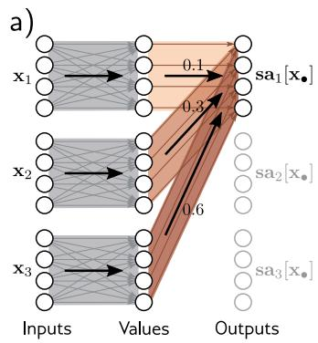

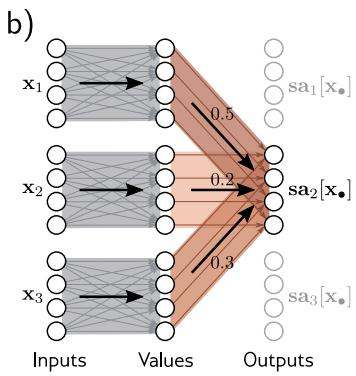

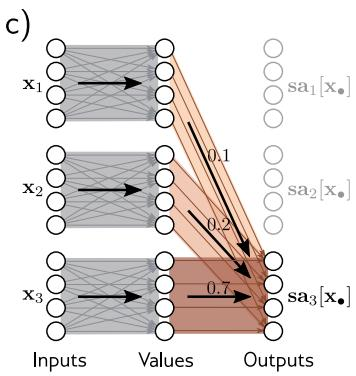

Figure 12.1 Self-attention as routing. The self-attention mechanism takes Ninputs ${ \bf x } _ { 1 } , \dots , { \bf x } _ { N } \in \mathbb { R } ^ { D }$ (here $N = 3$ and $D = 4 )$ and processes each separatelyto compute $N$ value vectors. The $n ^ { t h }$ output $\mathbf { s a } _ { n } \bigl [ \mathbf { x } _ { 1 } , \ldots \mathbf { \lbrack \varphi _ { n } \rbrack }$ (written as $\mathbf { s a } _ { n } [ \mathbf { x } _ { \bullet } ]$for short) is then computed as a weighted sum of the N value vectors, where theweights are positive and sum to one. a) Output sa $\left[ \mathbf { x _ { \bullet } } \right]$ is computed as $a [ \mathbf { x } _ { 1 } , \mathbf { x } _ { 1 } ] =$0.1 times the first value vector, $a [ { \bf x } _ { 2 } , { \bf x } _ { 1 } ] = 0 . 3$ times the second value vector,and $a [ { \bf x } _ { 3 } , { \bf x } _ { 1 } ] = 0 . 6$ times the third value vector. b) Output $\mathbf { s a } _ { 2 } [ \mathbf { x } _ { \bullet } ]$ is computedin the same way, but this time with weights of 0.5, 0.2, and $0 . 3 . \mathrm { ~ c ~ } )$ The weightingfor output $\mathbf { s a } _ { 3 } [ \mathbf { x } _ { \bullet } ]$ is different again. Each output can hence be thought of as adifferent routing of the N values.

# 12.2.1 Computing and weighting values

Equation 12.2 shows that the same weights $\pmb { \Omega } _ { v } \in \mathbb { R } ^ { D \times D }$ and biases $\boldsymbol { \beta } _ { v } \in \mathbb { R } ^ { D }$ are appliedto each input $\mathbf { x } _ { n } \in \mathbb { R } ^ { D }$ . This computation scales linearly with the sequence length N,so it requires fewer parameters than a fully connected network relating all DN inputsto all DN outputs. The value computation can be viewed as a sparse matrix operationwith shared parameters (figure 12.2b).

The attention weights $a [ \mathbf { x } _ { m } , \mathbf { x } _ { n } ]$ combine the values from different inputs. Theyare also sparse since there is only one weight for each ordered pair of inputs $\left( \mathbf { x } _ { m } , \mathbf { x } _ { n } \right)$ ,regardless of the size of these inputs (figure 12.2c). It follows that the number of attentionweights has a quadratic dependence on the sequence length N, but is independent of thelength D of each input ${ \bf x } _ { n }$ .

Problem 12.1

# 12.2.2 Computing attention weights

In the previous section, we saw that the outputs result from two chained linear transfor-mations; the value vectors $\beta _ { v } + \Omega _ { v } \mathbf { x } _ { m }$ are computed independently for each input $\mathbf { x } _ { m } .$ ,and these vectors are combined linearly by the attention weights a $\left[ \mathbf { x } _ { m } , \mathbf { x } _ { n } \right]$ . However, theoverall self-attention computation is nonlinear. As we’ll see shortly, the attention weightsare themselves nonlinear functions of the input. This is an example of a hypernetwork,where one network branch computes the weights of another.

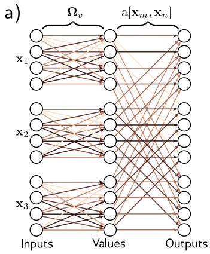

To compute the attention, we apply two more linear transformations to the inputs:

$$
{\bf q} _ {n} = \beta_ {q} + \Omega_ {q} {\bf x} _ {n}
$$

$$
\mathbf {k} _ {m} = \boldsymbol {\beta} _ {k} + \boldsymbol {\Omega} _ {k} \mathbf {x} _ {m}, \tag {12.4}
$$

Appendix B.3.4Dot product

where $\left\{ \mathbf { q } _ { n } \right\}$ and $\left\{ \mathbf { k } _ { m } \right\}$ are termed queries and keys, respectively. Then we compute dotproducts between the queries and keys and pass the results through a softmax function:

$$
\begin{array}{l} {a [ \mathbf {x} _ {m}, \mathbf {x} _ {n} ]} = {\mathrm{softmax} _ {m} \left[ \mathbf {k} _ {\bullet} ^ {T} \mathbf {q} _ {n} \right]} \\ = \frac {\exp \left[ \mathbf {k} _ {m} ^ {T} \mathbf {q} _ {n} \right]}{\sum_ {m ^ {\prime} = 1} ^ {N} \exp \left[ \mathbf {k} _ {m ^ {\prime}} ^ {T} \mathbf {q} _ {n} \right]}, \tag {12.5} \\ \end{array}
$$

so for each $\mathbf { x } _ { n } .$ , they are positive and sum to one (figure 12.3). For obvious reasons, thisis known as dot-product self-attention.

The names “queries” and “keys” were inherited from the field of information retrievaland have the following interpretation: the dot product operation returns a measure ofsimilarity between its inputs, so the weights $a [ \mathbf { x } _ { \bullet } , \mathbf { x } _ { n } ]$ depend on the relative similaritiesbetween the $n ^ { t h }$ query and all of the keys. The softmax function means that the keyvectors “compete” with one another to contribute to the final result. The queries andkeys must have the same dimensions. However, these can differ from the dimension ofthe values, which is usually the same size as the input, so the representation doesn’tchange size.

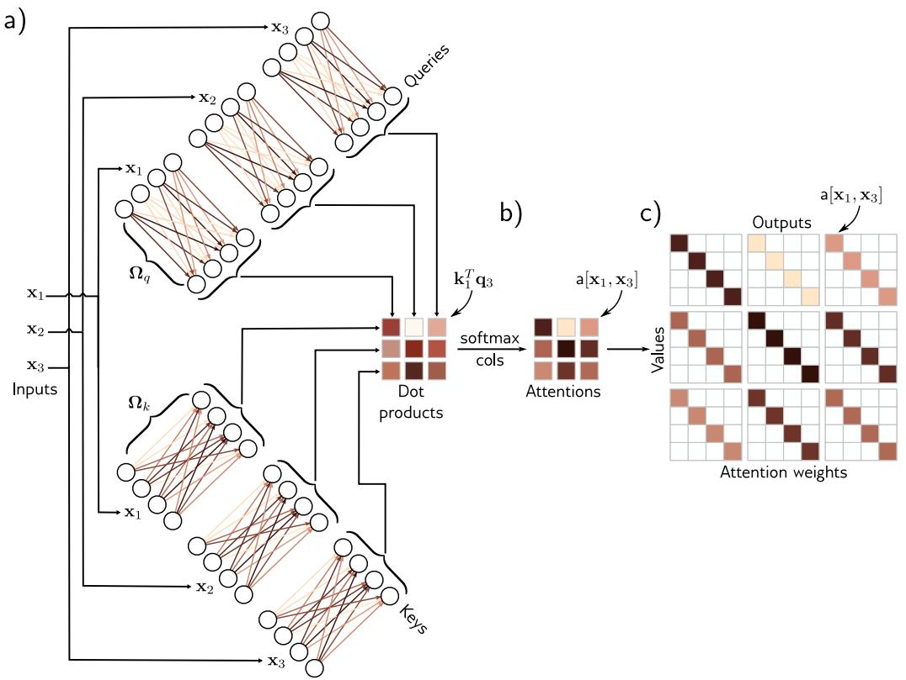

Figure 12.3 Computing attention weights. a) Query vectors ${ \bf q } _ { n } = \beta _ { q } + \Omega _ { q } { \bf x } _ { n }$and key vectors $\mathbf { k } _ { n } = \beta _ { k } + \Omega _ { k } \mathbf { x } _ { n }$ are computed for each input $\mathbf { x } _ { n } . \mathbf { \nabla } \mathrm { b } )$ The dotproducts between each query and the three keys are passed through a softmaxfunction to form non-negative attentions that sum to one. c) These route thevalue vectors (figure 12.1) via the sparse matrix from figure 12.2c.

Problem 12.2

# 12.2.3 Self-attention summary

The $n ^ { t h }$ output is a weighted sum of the same linear transformation $\mathbf { v _ { \bullet } } = \beta _ { v } + \Omega _ { v } \mathbf { x _ { \bullet } }$applied to all of the inputs, where these attention weights are positive and sum to one.The weights depend on a measure of similarity between input ${ \bf x } _ { n }$ and the other inputs.There is no activation function, but the mechanism is nonlinear due to the dot-productand a softmax operation used to compute the attention weights.

Note that this mechanism fulfills the initial requirements. First, there is a singleshared set of parameters $\boldsymbol { \phi } = \left\{ \beta _ { v } , \Omega _ { v } , \beta _ { q } , \Omega _ { q } , \beta _ { k } , \Omega _ { k } \right\}$ . This is independent of thenumber of inputs $N ,$ so the network can be applied to different sequence lengths. Second,there are connections between the inputs (words), and the strength of these connectionsdepends on the inputs themselves via the attention weights.

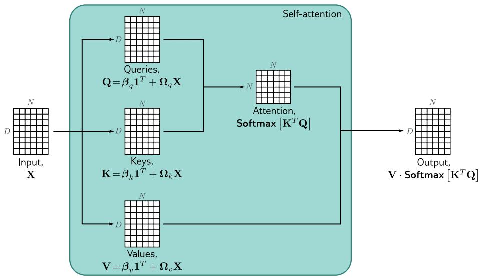

Figure 12.4 Self-attention in matrix form. Self-attention can be implementedefficiently if we store the N input vectors ${ \bf x } _ { n }$ in the columns of the $D { \times } N$ matrix X.The input X is operated on separately by the query matrix $\mathbf { Q } ,$ key matrix K, andvalue matrix V. The dot products are then computed using matrix multiplication,and a softmax operation is applied independently to each column of the resultingmatrix to calculate the attentions. Finally, the values are post-multiplied by theattentions to create an output of the same size as the input.

# 12.2.4 Matrix form

The above computation can be written in a compact form if the N inputs ${ \bf x } _ { n }$ form thecolumns of the $D \times N$ matrix X. The values, queries, and keys can be computed as:

$$
{\mathbf {V} [ \mathbf {X} ]} = {\boldsymbol {\beta} _ {v} \mathbf {1} ^ {\mathbf {T}} + \boldsymbol {\Omega} _ {v} \mathbf {X}}
$$

$$
\mathbf {Q} [ \mathbf {X} ] = \boldsymbol {\beta} _ {q} \mathbf {1} ^ {\mathbf {T}} + \boldsymbol {\Omega} _ {q} \mathbf {X}
$$

$$
\mathbf {K} [ \mathbf {X} ] = \boldsymbol {\beta} _ {k} \mathbf {1} ^ {\mathbf {T}} + \boldsymbol {\Omega} _ {k} \mathbf {X}, \tag {12.6}
$$

where 1 is an $N \times 1$ vector containing ones. The self-attention computation is then:

$$
\mathbf {S} \mathbf {a} [ \mathbf {X} ] = \mathbf {V} [ \mathbf {X} ] \cdot \mathbf {S} \mathbf {o f t m a x} \Big [ \mathbf {K} [ \mathbf {X} ] ^ {T} \mathbf {Q} [ \mathbf {X} ] \Big ], \tag {12.7}
$$

where the function Softmax[•] takes a matrix and performs the softmax operationindependently on each of its columns (figure 12.4). In this formulation, we have explicitlyincluded the dependence of the values, queries, and keys on the input X to emphasizethat self-attention computes a kind of triple product based on the inputs. However, fromnow on, we will drop this dependence and just write:

$$
\mathbf {S a} [ \mathbf {X} ] = \mathbf {V} \cdot \operatorname{Softmax} [ \mathbf {K} ^ {T} \mathbf {Q} ]. \tag {12.8}
$$

Notebook 12.1Self-attention

# 12.3 Extensions to dot-product self-attention

In the previous section, we described self-attention. Here, we introduce three extensionsthat are almost always used in practice.

# 12.3.1 Positional encoding

Observant readers will have noticed that the self-attention mechanism discards importantinformation: the computation is the same regardless of the order of the inputs $\mathbf { x } _ { n } .$More precisely, it is equivariant with respect to input permutations. However, order isimportant when the inputs correspond to the words in a sentence. The sentence Thewoman ate the raccoon has a different meaning than The raccoon ate the woman. Thereare two main approaches to incorporating position information.

Absolute positional encodings: A matrix Π is added to the input X that encodespositional information (figure 12.5). Each column of Π is unique and hence containsinformation about the absolute position in the input sequence. This matrix can bechosen by hand or learned. It may be added to the network inputs or at every networklayer. Sometimes it is added to X in the computation of the queries and keys but notto the values.

Problem 12.3

Relative positional encodings: The input to a self-attention mechanism may be anentire sentence, many sentences, or just a fragment of a sentence, and the absoluteposition of a word is much less important than the relative position between two inputs.Of course, this can be recovered if the system knows the absolute position of both,but relative positional encodings encode this information directly. Each element of theattention matrix corresponds to a particular offset between query position a and keyposition b. Relative positional encodings learn a parameter $\pi _ { a , b }$ for each offset and usethis to modify the attention matrix by adding these values, multiplying by them, orusing them to alter the attention matrix in some other way.

# 12.3.2 Scaled dot product self-attention

The dot products in the attention computation can have large magnitudes and movethe arguments to the softmax function into a region where the largest value completelydominates. Small changes to the inputs to the softmax function now have little effect onthe output (i.e., the gradients are very small), making the model difficult to train. Toprevent this, the dot products are scaled by the square root of the dimension $D _ { q }$ of thequeries and keys (i.e., the number of rows in $\Omega _ { q }$ and $\Omega _ { k }$ , which must be the same):

$$
\mathbf {S a} [ \mathbf {X} ] = \mathbf {V} \cdot \text { Softmax } \left[ \frac {\mathbf {K} ^ {T} \mathbf {Q}}{\sqrt {D _ {q}}} \right]. \tag {12.9}
$$

This is known as scaled dot product self-attention.

# 12.3.3 Multiple heads

Multiple self-attention mechanisms are usually applied in parallel, and this is known asmulti-head self-attention. Now H different sets of values, keys, and queries are computed:

$$
{\bf V} _ {h} = \beta_ {v h} {\bf 1} ^ {\mathrm{T}} + \Omega_ {v h} {\bf X}
$$

$$
{\bf Q} _ {h} = \beta_ {q h} {\bf 1 ^ {T}} + \Omega_ {q h} {\bf X}
$$

$$
\mathbf {K} _ {h} = \boldsymbol {\beta} _ {k h} \mathbf {1} ^ {\mathbf {T}} + \boldsymbol {\Omega} _ {k h} \mathbf {X}. \tag {12.10}
$$

The $h ^ { t h }$ self-attention mechanism or head can be written as:

$$
\mathbf {S a} _ {h} [ \mathbf {X} ] = \mathbf {V} _ {h} \cdot \text { Softmax } \left[ \frac {\mathbf {K} _ {h} ^ {T} \mathbf {Q} _ {h}}{\sqrt {D} _ {q}} \right], \tag {12.11}
$$

where we have different parameters $\{ \beta _ { v h } , \Omega _ { v h } \} , \ \{ \beta _ { q h } , \Omega _ { q h } \}$ , and $\{ \beta _ { k h } , \Omega _ { k h } \}$ for eachhead. Typically, if the dimension of the inputs $\mathbf { x } _ { m }$ is D and there are H heads, the values,queries, and keys will all be of size $D / H$ , as this allows for an efficient implementation.The outputs of these self-attention mechanisms are vertically concatenated, and anotherlinear transform $\Omega _ { c }$ is applied to combine them (figure 12.6):

Problem 12.4

Problem 12.5

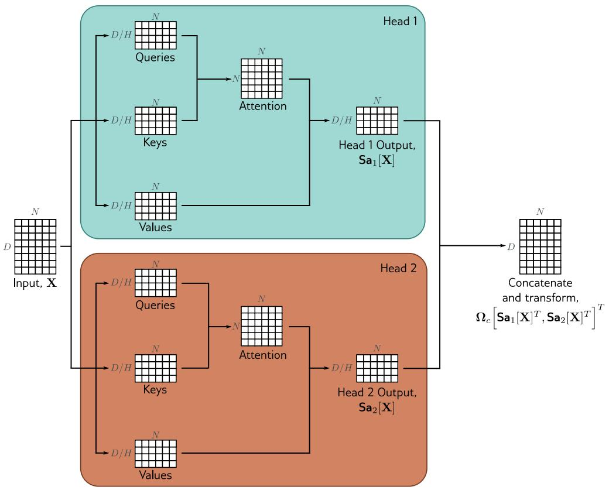

Figure 12.6 Multi-head self-attention. Self-attention occurs in parallel acrossmultiple “heads.” Each has its own queries, keys, and values. Here two heads aredepicted, in the cyan and orange boxes, respectively. The outputs are verticallyconcatenated, and another linear transformation $\Omega _ { c }$ is used to recombine them.

$$
\mathbf {M h S a} [ \mathbf {X} ] = \boldsymbol {\Omega} _ {c} \left[ \mathbf {S a} _ {1} [ \mathbf {X} ] ^ {T}, \mathbf {S a} _ {2} [ \mathbf {X} ] ^ {T}, \dots , \mathbf {S a} _ {H} [ \mathbf {X} ] ^ {T} \right] ^ {T}. \tag {12.12}
$$

Multiple heads seem to be necessary to make the transformer work well. It has beenspeculated that they make the self-attention network more robust to bad initializations.

Notebook 12.2

Multi-head

self-attention

# 12.4 Transformers

Self-attention is just one part of a larger transformer mechanism. This consists of amulti-head self-attention unit (which allows the word representations to interact witheach other) followed by a fully connected network mlp[x ] (that operates separatelyon each word). Both units are residual networks (i.e., their output is added back tothe original input). In addition, it is typical to add a LayerNorm operation after boththe self-attention and fully connected networks. This is similar to BatchNorm but usesstatistics across the tokens within a single input sequence to perform the normalization(section 11.4 and figure 11.14). The complete layer can be described by the followingseries of operations (figure 12.7):

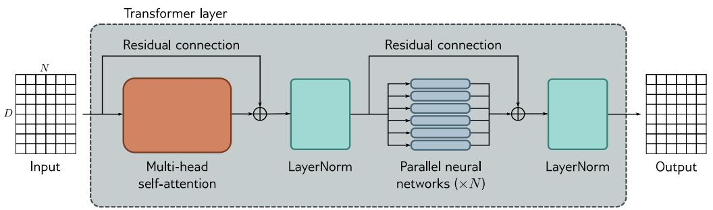

Figure 12.7 The transformer. The input consists of a $D \times N$ matrix containingthe D-dimensional word embeddings for each of the N input tokens. The outputis a matrix of the same size. The transformer consists of a series of operations.First, there is a multi-head attention block, allowing the word embeddings tointeract with one another. This forms the processing of a residual block, so theinputs are added back to the output. Second, a LayerNorm operation is applied.Third, there is a second residual layer where the same fully connected neuralnetwork is applied separately to each of the N word representations (columns).Finally, LayerNorm is applied again.

$$
\mathbf {X} \leftarrow \mathbf {X} + \operatorname{MhSa} [ \mathbf {X} ]
$$

$$
\mathrm{X} \leftarrow \text { LayerNorm } [ \mathrm{X} ]
$$

$$
\mathbf {x} _ {n} \leftarrow \mathbf {x} _ {n} + \operatorname{mlp} [ \mathbf {x} _ {n} ] \quad \forall n \in \{1, \dots , N \}
$$

$$
\mathbf {X} \leftarrow \text { LayerNorm } [ \mathbf {X} ], \tag {12.13}
$$

where the column vectors ${ \bf x } _ { n }$ are separately taken from the full data matrix X. In a realnetwork, the data passes through a series of these transformers.

# 12.5 Transformers for natural language processing

The previous section described the transformer. This section describes how it is used innatural language processing (NLP) tasks. A typical NLP pipeline starts with a tokenizerthat splits the text into words or word fragments. Then each of these tokens is mapped

<table><tr><td colspan="17">a_sailor_went_to_sea_sea_sea_</td></tr><tr><td colspan="17">to_see_what_he_could_see_see_see_</td></tr><tr><td colspan="17">but_all_that_he_could_see_see_see_</td></tr><tr><td colspan="17">was_the_bottom_of_the_deep_blue_sea_sea_sea_</td></tr><tr><td>| _ | e | s | a | t | o | h | l | u | b | d | w | c | f | i | m | n | p | r | 33 | 28 | 15 | 12 | 11 | 8 | 6 | 6 | 4 | 3 | 3 | 3 | 2 | 1 | 1 | 1 | 1 | 1 | 1 | 1 |
&lt;/p&gt;</td><td></td><td></td><td></td><td></td><td></td><td></td><td></td><td></td><td></td><td></td><td></td><td></td><td></td><td></td><td></td><td></td></tr></table>

c)

<table><tr><td colspan="19">a_sailor_went_to_sea_sea_sea_</td><td></td></tr><tr><td colspan="19">to_see_what_he_could_see_see_see_</td><td></td></tr><tr><td colspan="19">but_all_that_he_could_see_see_see_</td><td></td></tr><tr><td colspan="19">was_the_bottom_of_the_deep_blue_sea_sea_sea_</td><td></td></tr><tr><td>| _ | se | a | e_ | t | o | h | l | u | b | d | e | w | c | s | f | i | m | n | p | r | 21 | 13 | 12 | 12 | 11 | 8 | 6 | 6 | 4 | 3 | 3 | 3 | 3 | 2 | 2 | 1 | 1 | 1 | 1 | 1 | 1 |</td><td>:</td><td>:</td><td>:</td><td>:</td><td>:</td><td>:</td><td>:</td><td>:</td><td>:</td><td>:</td><td>:</td><td>:</td><td>:</td><td>:</td><td>:</td><td>:</td><td>:</td><td>:</td><td>:</td></tr></table>

d)

<table><tr><td>|see_</td><td>|sea_</td><td>|e</td><td>|b</td><td>|l</td><td>|w</td><td>|a</td><td>|could_</td><td>|hat_</td><td>|he_</td><td>|o</td><td>|t</td><td>|t_</td><td>|the_</td><td>|to_</td><td>|u</td><td>|a_</td><td>|d</td><td>|f</td><td>|m</td><td>|n</td><td>|p</td><td>|s</td><td>|sailor_</td><td>|to</td></tr><tr><td>7</td><td>6</td><td>4</td><td>3</td><td>3</td><td>3</td><td>3</td><td>2</td><td>2</td><td>2</td><td>2</td><td>2</td><td>2</td><td>2</td><td>2</td><td>2</td><td>2</td><td>1</td><td>1</td><td>1</td><td>1</td><td>1</td><td>1</td><td>1</td><td>1</td></tr><tr><td></td><td></td><td></td><td></td><td></td><td></td><td></td><td></td><td></td><td></td><td></td><td></td><td></td><td></td><td></td><td></td><td></td><td></td><td></td><td></td><td></td><td></td><td></td><td></td><td></td></tr><tr><td></td><td></td><td></td><td></td><td></td><td></td><td></td><td></td><td></td><td></td><td></td><td></td><td></td><td></td><td></td><td></td><td></td><td></td><td></td><td></td><td></td><td></td><td></td><td></td><td></td></tr><tr><td></td><td></td><td></td><td></td><td></td><td></td><td></td><td></td><td></td><td></td><td></td><td></td><td></td><td></td><td></td><td></td><td></td><td></td><td></td><td></td><td></td><td></td><td></td><td></td><td></td></tr></table>

e)

<table><tr><td>see_</td><td>sea_</td><td>could_</td><td>he_</td><td>the_</td><td>a_</td><td>all_</td><td>blue_</td><td>bottom_</td><td>but_</td><td>deep_</td><td>of_</td><td>sailor_</td><td>that_</td><td>to_</td><td>was_</td><td>went_</td><td>what_</td></tr><tr><td>7</td><td>6</td><td>2</td><td>2</td><td>2</td><td>1</td><td>1</td><td>1</td><td>1</td><td>1</td><td>1</td><td>1</td><td>1</td><td>1</td><td>1</td><td>1</td><td>1</td><td>1</td></tr></table>

to a learned embedding. These embeddings are passed through a series of transformers.We now consider each of these stages in turn.

# 12.5.1 Tokenization

A text processing pipeline begins with a tokenizer. This splits the text into smallerconstituent units (tokens) from a vocabulary of possible tokens. In the discussion above,we have implied that these tokens represent words, but there are several difficulties.

• Inevitably, some words (e.g., names) will not be in the vocabulary.

• It’s unclear how to handle punctuation, but this is important. If a sentence endsin a question mark, we must encode this information.

• The vocabulary would need different tokens for versions of the same word withdifferent suffixes (e.g., walk, walks, walked, walking), and there is no way to clarifythat these variations are related.

One approach would be to use letters and punctuation marks as the vocabulary, but thiswould mean splitting text into very small parts and requiring the subsequent network tore-learn the relations between them.

In practice, a compromise between letters and full words is used, and the final vo-cabulary includes both common words and word fragments from which larger and lessfrequent words can be composed. The vocabulary is computed using a sub-word tok-enizer such as byte pair encoding (figure 12.8) that greedily merges commonly occurringsub-strings based on their frequency.

Notebook 12.3Tokenization

# 12.5.2 Embeddings

Each token in the vocabulary V is mapped to a unique word embedding, and the embed-dings for the whole vocabulary are stored in a matrix $\Omega _ { e } \in \mathbb { R } ^ { D \times | \mathcal { V } | }$ . To accomplish this,the N input tokens are first encoded in the matrix $\mathbf { T } \in \mathbb { R } ^ { | \mathcal { V } | \times N }$ , where the $n ^ { { \bar { t } } h }$ columncorresponds to the $n ^ { t h }$ token and is a $| \nu | \times 1$ one-hot vector (i.e., a vector where everyentry is zero except for the entry corresponding to the token, which is set to one). Theinput embeddings are computed as $\mathbf { X } = \Omega _ { e } \mathbf { T }$ , and $\pmb { \Omega } _ { e }$ is learned like any other networkparameter (figure 12.9). A typical embedding size D is 1024, and a typical total vocab-ulary size |V| is 30,000, so even before the main network, there are many parametersin $\pmb { \Omega } _ { e }$ to learn.

# 12.5.3 Transformer model

Finally, the embedding matrix X representing the text is passed through a series of Ktransformers, called a transformer model. There are three types of transformer models.An encoder transforms the text embeddings into a representation that can support avariety of tasks. A decoder predicts the next token to continue the input text. Encoder-decoders are used in sequence-to-sequence tasks, where one text string is converted intoanother (e.g., machine translation). These variations are described in sections 12.6–12.8,respectively.

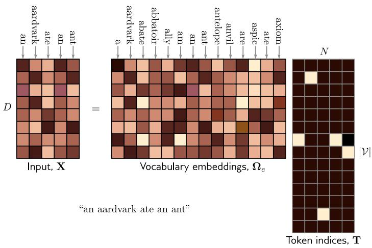

Figure 12.9 The input embedding matrix $\mathbf { X } \in \mathbb { R } ^ { D \times N }$ contains N embeddings oflength D and is created by multiplying a matrix $\pmb { \Omega } _ { e }$ containing the embeddingsfor the entire vocabulary with a matrix containing one-hot vectors in its columnsthat correspond to the word or sub-word indices. The vocabulary matrix $\pmb { \Omega } _ { e }$ isconsidered a parameter of the model and is learned along with the other param-eters. Note that the two embeddings for the word an in $\mathbf { \breve { X } }$ are the same.

# 12.6 Encoder model example: BERT

BERT is an encoder model that uses a vocabulary of 30,000 tokens. Input tokens areconverted to 1024-dimensional word embeddings and passed through 24 transformers.Each contains a self-attention mechanism with 16 heads. The queries, keys, and valuesfor each head are of dimension 64 (i.e., the matrices $\Omega _ { v h } , \Omega _ { q h } , \Omega _ { k h }$ are $1 0 2 4 \times 6 4 )$ . Thedimension of the single hidden layer in the fully connected network in the transformer is4096. The total number of parameters is ∼ 340 million. When BERT was introduced,this was considered large, but it is now much smaller than state-of-the-art models.

Encoder models like BERT exploit transfer learning (section 9.3.6). During pre-training, the parameters of the transformer architecture are learned using self-supervisionfrom a large corpus of text. The goal here is for the model to learn general informationabout the statistics of language. In the fine-tuning stage, the resulting network is adaptedto solve a particular task using a smaller body of supervised training data.

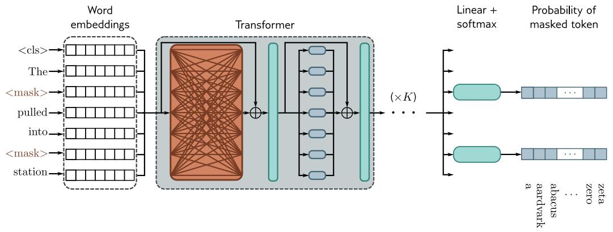

Figure 12.10 Pre-training for BERT-like encoder. The input tokens (and a spe-cial <cls> token denoting the start of the sequence) are converted to word em-beddings. Here, these are represented as rows rather than columns, so the boxlabeled “word embeddings” is $\mathbf { X } ^ { T }$ . These embeddings are passed through a seriesof transformers (orange connections indicate that every token attends to everyother token in these layers) to create a set of output embeddings. A small frac-tion of the input tokens is randomly replaced with a generic <mask> token. Inpre-training, the goal is to predict the missing word from the associated outputembedding. As such, the output embeddings are passed through a softmax func-tion, and the multiclass classification loss (section 5.24) is used. This task hasthe advantage that it uses both the left and right context to predict the missingword but has the disadvantage that it does not make efficient use of data; here,seven tokens need to be processed to add two terms to the loss function.

# 12.6.1 Pre-training

Problem 12.6

In the pre-training stage, the network is trained using self-supervision. This allows theuse of enormous amounts of data without the need for manual labels. For BERT, the self-supervision task consists of predicting missing words from sentences from a large internetcorpus (figure 12.10).1 During training, the maximum input length is 512 tokens, andthe batch size is 256. The system is trained for a million steps, corresponding to roughly50 epochs of the 3.3-billion word corpus.

Predicting missing words forces the transformer network to understand some syntax.For example, it might learn that the adjective red is often found before nouns like houseor car but never before a verb like shout. It also allows the model to learn superficialcommon sense about the world. For example, after training, the model will assign ahigher probability to the missing word train in the sentence The <mask> pulled intothe station than it would to the word peanut. However, the degree of “understanding”this type of model can ever have is limited.

a

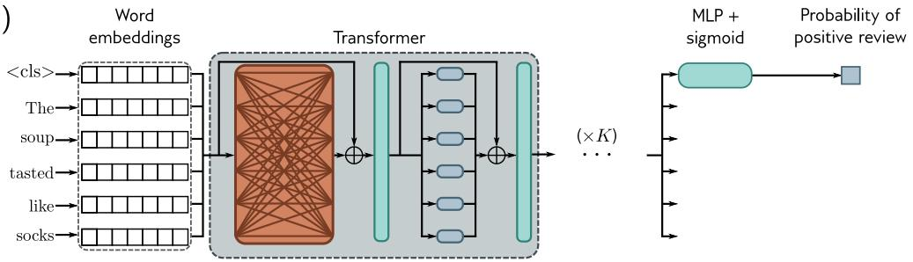

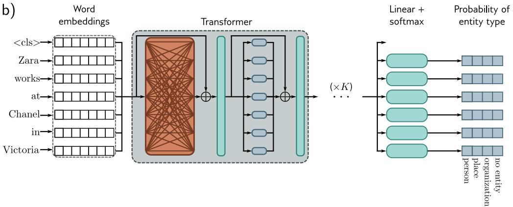

Figure 12.11 After pre-training, the encoder is fine-tuned using manually labeleddata to solve a particular task. Usually, a linear transformation or a multi-layerperceptron (MLP) is appended to the encoder to produce whatever output isrequired. a) Example text classification task. In this sentiment classificationtask, the <cls> token embedding is used to predict the probability that thereview is positive. b) Example word classification task. In this named entityrecognition problem, the embedding for each word is used to predict whether theword corresponds to a person, place, or organization, or is not an entity.

# 12.6.2 Fine-tuning

In the fine-tuning stage, the model parameters are adjusted to specialize the network toa particular task. An extra layer is appended onto the transformer network to convertthe output vectors to the desired output format. Examples include:

Text classification: In BERT, a special token known as the classification or <cls>token is placed at the start of each string during pre-training. For text classificationtasks like sentiment analysis (in which the passage is labeled as having a positive ornegative emotional tone), the vector associated with the <cls> token is mapped to asingle number and passed through a logistic sigmoid (figure 12.11a). This contributes toa standard binary cross-entropy loss (section 5.4).

Word classification: The goal of named entity recognition is to classify each word asan entity type (e.g., person, place, organization, or no-entity). To this end, each inputembedding ${ \bf x } _ { n }$ is mapped to an $E \times 1$ vector where the E entries correspond to the Eentity types. This is passed through a softmax function to create probabilities for eachclass, which contribute to a multiclass cross-entropy loss (figure 12.11b).

Text span prediction: In the SQuAD 1.1 question answering task, the question and apassage from Wikipedia containing the answer are concatenated and tokenized. BERTis then used to predict the text span in the passage that contains the answer. Eachtoken maps to two numbers indicating how likely it is that the text span begins andends at this location. The resulting two sets of numbers are put through two softmaxfunctions. The likelihood of any text span being the answer can be derived by combiningthe probability of starting and ending at the appropriate places.

# 12.7 Decoder model example: GPT3

This section presents a high-level description of GPT3, an example of a decoder model.The basic architecture is extremely similar to the encoder model and comprises a series oftransformers that operate on learned word embeddings. However, the goal is different.The encoder aimed to build a representation of the text that could be fine-tuned tosolve a variety of more specific NLP tasks. Conversely, the decoder has one purpose: togenerate the next token in a sequence. It can generate a coherent text passage by feedingthe extended sequence back into the model.

# 12.7.1 Language modeling

GPT3 constructs an autoregressive language model. This is easiest to understand witha concrete example. Consider the sentence It takes great courage to let yourself appearweak. For simplicity, let’s assume that the tokens are the full words. The probability ofthe full sentence is:

$Pr(\text{It takes great courage to let yourself appear weak}) =$ $Pr(\text{It}) \times Pr(\text{takes}|\text{It}) \times Pr(\text{great}|\text{It takes}) \times Pr(\text{courage}|\text{It takes great}) \times$ $Pr(\text{to}|\text{It takes great courage}) \times Pr(\text{let}|\text{It takes great courage to}) \times$ $Pr(\text{yourself}|\text{It takes great courage to let}) \times$ $Pr(\text{appear}|\text{It takes great courage to let yourself}) \times$ $Pr(\text{weak}|\text{It takes great courage to let yourself appear}).$  (12.14)

More formally, an autoregressive model factors the joint probability $P r ( t _ { 1 } , t _ { 2 } , \dots , t _ { N } )$ ofthe N observed tokens into an autoregressive sequence:

$$
P r (t _ {1}, t _ {2}, \dots , t _ {N}) = P r (t _ {1}) \prod_ {n = 2} ^ {N} P r (t _ {n} | t _ {1}, \dots , t _ {n - 1}). \tag {12.15}
$$

The autoregressive formulation demonstrates the connection between maximizing the logprobability of the tokens in the loss function and the next token prediction task.

# 12.7.2 Masked self-attention

To train a decoder, we maximize the log probability of the input text under the autore-gressive model. Ideally, we would pass in the whole sentence and compute all the logprobabilities and gradients simultaneously. However, this poses a problem; if we pass inthe full sentence, the term computing log [P r(great|It takes)] has access to both the an-swer great and the right context courage to let yourself appear weak. Hence, the systemcan cheat rather than learn to predict the following words and will not train properly.

Fortunately, the tokens only interact in the self-attention layers in a transformernetwork. Hence, the problem can be resolved by ensuring that the attention to theanswer and the right context is zero. This can be achieved by setting the correspondingdot products in the self-attention computation (equation 12.5) to negative infinity beforethey are passed through the softmax[•] function. This is known as masked self-attention.The effect is to make the weight of all the upward-angled arrows in figure 12.1 zero.

The entire decoder network operates as follows. The input text is tokenized, and thetokens are converted to embeddings. The embeddings are passed into the transformernetwork, but now the transformers use masked self-attention so that they can only attendto the current and previous tokens. Each of the output embeddings can be thought of asrepresenting a partial sentence, and for each, the goal is to predict the next token in thesequence. Consequently, after the transformers, a linear layer maps each word embeddingto the size of the vocabulary, followed by a softmax[•] function that converts these valuesto probabilities. During training, we aim to maximize the sum of the log probabilities ofthe next token in the ground truth sequence at every position using a standard multiclasscross-entropy loss (figure 12.12).

# 12.7.3 Generating text from a decoder

The autoregressive language model is the first example of a generative model discussedin this book. Since it defines a probability model over text sequences, it can be usedto sample new examples of plausible text. To generate from the model, we start withan input sequence of text (which might be just a special <start> token indicating thebeginning of the sequence) and feed this into the network, which then outputs the proba-bilities over possible subsequent tokens. We can then either pick the most likely token orsample from this probability distribution. The new extended sequence can be fed backinto the decoder network that outputs the probability distribution over the next token.By repeating this process, we can generate large bodies of text. The computation canbe made quite efficient as prior embeddings do not depend on subsequent ones due to

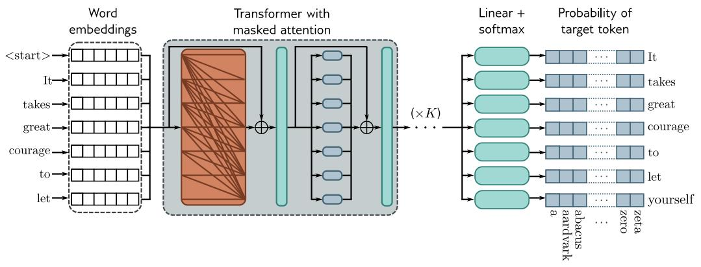

Figure 12.12 Training GPT3-type decoder network. The tokens are mapped toword embeddings with a special <start> token at the beginning of the sequence.The embeddings are passed through a series of transformers that use maskedself-attention. Here, each position in the sentence can only attend to its ownembedding and the embeddings of tokens earlier in the sequence (orange connec-tions). The goal at each position is to maximize the probability of the followingground truth token in the sequence. In other words, at position one, we want tomaximize the probability of the token It; at position two, we want to maximizethe probability of the token takes; and so on. Masked self-attention ensures thesystem cannot cheat by looking at subsequent inputs. The autoregressive task hasthe advantage of making efficient use of the data since every word contributes aterm to the loss function. However, it only exploits the left context of each word.

Problem 12.7

Notebook 12.4Decodingstrategies

the masked self-attention. Hence, much of the earlier computation can be recycled as wegenerate subsequent tokens.

In practice, many strategies can make the output text more coherent. For example,beam search keeps track of multiple possible sentence completions to find the overall mostlikely (which is not necessarily found by greedily choosing the most likely next word ateach step). Top-k sampling randomly draws the next word from only the top-K mostlikely possibilities to prevent the system from accidentally choosing from the long tail oflow-probability tokens and leading to an unnecessary linguistic dead end.

# 12.7.4 GPT3 and few-shot learning

Large language models like GPT3 apply these ideas on a massive scale. In GPT3, thesequence lengths are 2048 tokens long, and the total batch size is 3.2 million tokens.There are 96 transformers (some of which implement a sparse version of attention), eachprocessing a word embedding of size 12288. There are 96 heads in the self-attentionlayers, and the value, query, and key dimension is 128. It is trained with 300 billiontokens and contains 175 billion parameters.

Here’s an example of completing text from the GPT3 model where the text providedto the model is in orange, and the generated text is in cyan:

Understanding Deep Learning is a new textbook from MIT Press by Simon Prince that’s de-signed to offer an accessible, broad introduction to the field. Deep learning is a branch ofmachine learning that is concerned with algorithms that learn from data that is unstructuredor unlabeled. The book is divided into four sections:

1. Introduction to deep learning

2. Deep learning architecture

3. Deep learning algorithms

4. Applications of deep learning

The first section offers an introduction to deep learning, including its history and origins.The second section covers deep learning architecture, discussing various types of neural net-works and their applications. The third section dives into deep learning algorithms, includingsupervised and unsupervised learning, reinforcement learning, and more. The fourth sectionapplies deep learning to various domains, such as computer vision, natural language processing,and robotics.

This continuation is plausible, albeit only partially accurate.

One surprising property of learning models on this scale is that they can perform manytasks without fine-tuning. If we provide several examples of correct question/answer pairsand then another question, they often answer the final question correctly by completingthe sequence. One example is correcting English grammar:

Poor English input: I eated the purple berries.

Good English output: I ate the purple berries.

Poor English input: Thank you for picking me as your designer. I’d appreciate it.

Good English output: Thank you for choosing me as your designer. I appreciate it.

Poor English input: The mentioned changes have done. or I did the alteration that yourequested. or I changed things you wanted and did the modifications.

Good English output: The requested changes have been made. or I made the alteration thatyou requested. or I changed things you wanted and made the modifications.

Poor English input: I’d be more than happy to work with you in another project.

Good English output: I’d be more than happy to work with you on another project.

(result from Brown et al., 2020)

Here, the text containing the paired examples in orange was provided as context forGPT3, and the system then generated the correct answer in cyan. This phenomenonextends to many situations, including generating code snippets based on natural languagedescriptions, arithmetic, translating between languages, and answering questions abouttext passages. Consequently, it is argued that enormous language models are few-shotlearners; they can learn to do novel tasks based on just a few examples. However,performance is erratic in practice, and the extent to which it is extrapolating fromlearned examples rather than merely interpolating or copying verbatim is unclear.

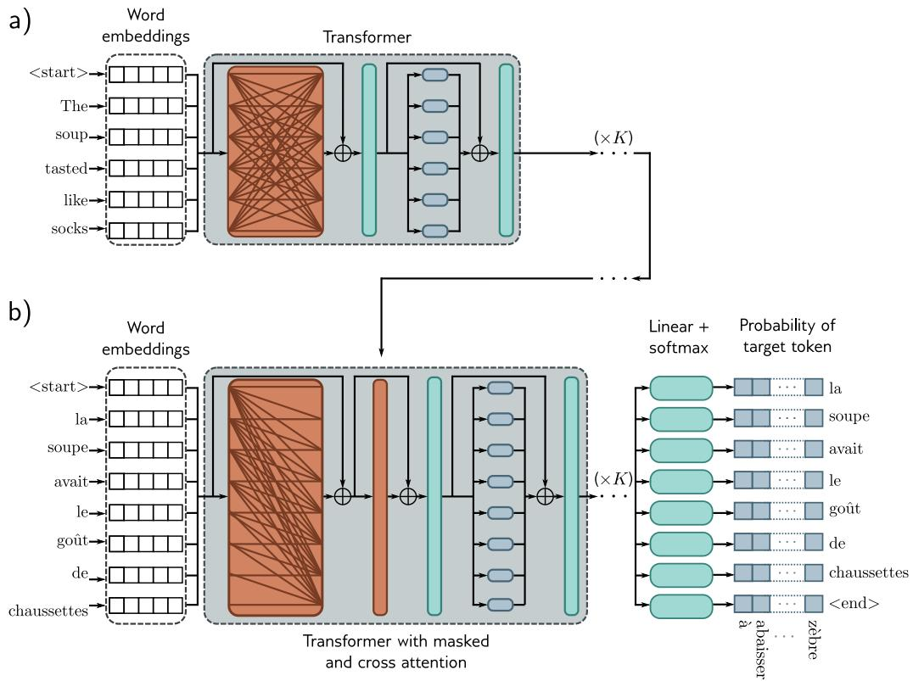

Figure 12.13 Encoder-decoder architecture. Two sentences are passed to thesystem with the goal of translating the first into the second. a) The first sentenceis passed through a standard encoder. b) The second sentence is passed through adecoder that uses masked self-attention but also attends to the output embeddingsof the encoder using cross-attention (orange rectangle). The loss function is thesame as for the decoder model; we want to maximize the probability of the nextword in the output sequence.

# 12.8 Encoder-decoder model example: machine translation

Translation between languages is an example of a sequence-to-sequence task. This re-quires an encoder (to compute a good representation of the source sentence) and adecoder (to generate the sentence in the target language). This task can be tackledusing an encoder-decoder model.

Consider translating from English to French. The encoder receives the sentence inEnglish and processes it through a series of transformers to create an output representa-tion for each token. During training, the decoder receives the ground truth translationin French and passes it through a series of transformers that use masked self-attentionand predict the following word at each position. However, the decoder layers also attendto the output of the encoder. Consequently, each French output word is conditioned onthe previous output words and the source English sentence (figure 12.13).

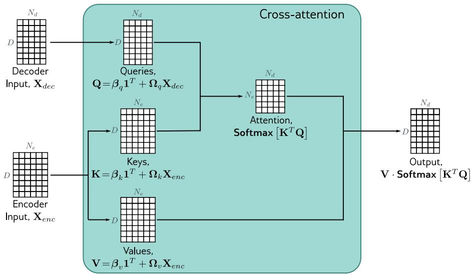

Figure 12.14 Cross-attention. The flow of computation is the same as in stan-dard self-attention. However, the queries are calculated from the decoder embed-dings $\mathbf { X } _ { d e c } ,$ , and the keys and values from the encoder embeddings ${ \bf X } _ { e n c } .$ . In thecontext of translation, the encoder contains information about the source lan-guage, and the decoder contains information about the target language statistics.

This is achieved by modifying the transformers in the decoder. The original trans-former in the decoder (figure 12.12) consisted of a masked self-attention layer followedby a neural network applied individually to each embedding. A new self-attention layeris added between these two components, in which the decoder embeddings attend to theencoder embeddings. This uses a version of self-attention known as encoder-decoder at-tention or cross-attention, where the queries are computed from the decoder embeddingsand the keys and values from the encoder embeddings (figure 12.14).

# 12.9 Transformers for long sequences

Since each token in a transformer encoder model interacts with every other token, thecomputational complexity scales quadratically with the length of the sequence. For adecoder model, each token only interacts with previous tokens, so there are roughlyhalf the number of interactions, but the complexity still scales quadratically. Theserelationships can be visualized as interaction matrices (figure 12.15a–b).

This quadratic increase in the amount of computation ultimately limits the length ofsequences that can be used. Many methods have been developed to extend the trans-former to cope with longer sequences. One approach is to prune the self-attention in-teractions or, equivalently, to sparsify the interaction matrix (figures 12.15c-h). Forexample, this can be restricted to a convolutional structure so that each token only in-teracts with a few neighboring tokens. Across multiple layers, tokens still interact atlarger distances as the receptive field expands. As for convolution in images, the kernelcan vary in size and dilation rate.

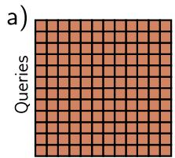

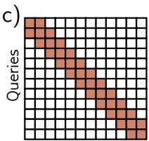

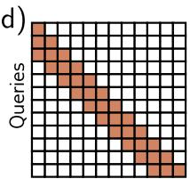

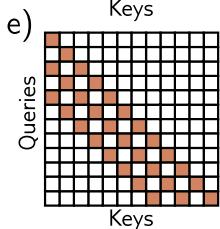

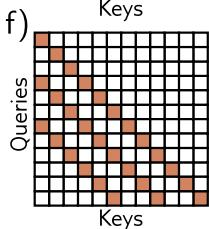

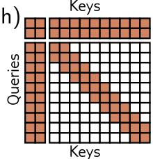

Figure 12.15 Interaction matrices for self-attention. a) In an encoder, every tokeninteracts with every other token, and computation expands quadratically with thenumber of tokens. b) In a decoder, each token only interacts with the previoustokens, but complexity is still quadratic. c) Complexity can be reduced by usinga convolutional structure (encoder case). d) Convolutional structure for decodercase. e–f) Convolutional structure with dilation rate of two and three (decodercase). g) Another strategy is to allow selected tokens to interact with all theother tokens (encoder case) or all the previous tokens (decoder case pictured).h) Alternatively, global tokens can be introduced (left two columns and top tworows). These interact with all of the tokens as well as with each other.

A pure convolutional approach requires many layers to integrate information overlarge distances. One way to speed up this process is to allow select tokens (perhaps atthe start of every sentence) to attend to all other tokens (encoder model) or all previoustokens (decoder model). A similar idea is to have a small number of global tokens thatconnect to all the other tokens and themselves. Like the <cls> token, these do notrepresent any word but serve to provide long-distance connections.

# 12.10 Transformers for images

Transformers were initially developed for text data. Their enormous success in this arealed to experimentation on images. This was not obviously a promising idea for tworeasons. First, there are many more pixels in an image than words in a sentence, so thequadratic complexity of self-attention poses a practical bottleneck. Second, convolutionalnets have a good inductive bias because each layer is equivariant to spatial translation,and they take into account the 2D structure of the image. However, this must be learnedin a transformer network.

Regardless of these apparent disadvantages, transformer networks for images havenow eclipsed the performance of convolutional networks for image classification and othertasks. This is partly because of the enormous scale at which they can be constructedand the large amounts of data that can be used to pre-train the networks. This sectiondescribes transformer models for images.

# 12.10.1 ImageGPT

ImageGPT is a transformer decoder; it builds an autoregressive model of image pixelsthat ingests a partial image and predicts the subsequent pixel value. The quadraticcomplexity of the transformer network means that the largest model (which contained6.8 billion parameters) could still only operate on 64×64 images. Moreover, to make thistractable, the original 24-bit RGB color space had to be quantized into a nine-bit colorspace, so the system ingests (and predicts) one of 512 possible tokens at each position.

Images are naturally 2D objects, but ImageGPT simply learns a different positionalencoding at each pixel. Hence it must learn that each pixel has a close relationship withits preceding neighbors and also with nearby pixels in the row above. Figure 12.16 showsexample generation results.

The internal representation of this decoder was used as a basis for image classification.The final pixel embeddings are averaged, and a linear layer maps these to activationswhich are passed through a softmax layer to predict class probabilities. The system is pre-trained on a large corpus of web images and then fine-tuned on the ImageNet databaseresized to 48 × 48 pixels using a loss function that contains both a cross-entropy term forimage classification and a generative loss term for predicting the pixels. Despite using alarge amount of external training data, the system achieved only a 27.4% top-1 error rateon ImageNet (figure 10.15). This was less than convolutional architectures of the time(see figure 10.21) but is still impressive given the small input image size; unsurprisingly,it fails to classify images where the target object is small or thin.

# 12.10.2 Vision Transformer (ViT)

The Vision Transformer tackled the problem of image resolution by dividing the imageinto 16×16 patches (figure 12.17). Each patch is mapped to a lower dimension via alearned linear transformation, and these representations are fed into the transformernetwork. Once again, standard 1D positional encodings are learned.

This is an encoder model with a <cls> token (see figures 12.10–12.11). However,unlike BERT, it uses supervised pre-training on a large database of 303 million labeledimages from 18,000 classes. The <cls> token is mapped via a final network layer tocreate activations that are fed into a softmax function to generate class probabilities.After pre-training, the system is applied to the final classification task by replacing thisfinal layer with one that maps to the desired number of classes and is fine-tuned.

Figure 12.16 ImageGPT. a) Images generated from the autoregressive ImageGPTmodel. The top-left pixel is drawn from the estimated empirical distribution atthis position. Subsequent pixels are generated in turn, conditioned on the previousones, working along the rows until the bottom-right of the image is reached. Foreach pixel, the transformer decoder generates a conditional distribution as inequation 12.15, and a sample is drawn. The extended sequence is then fed backinto the network to generate the next pixel, and so on. b) Image completion.In each case, the lower half of the image is removed (top row), and ImageGPTcompletes the remaining part pixel by pixel (three different completions shown).Adapted from https://openai.com/blog/image-gpt/.

For the ImageNet benchmark, this system achieved an 11.45% top-1 error rate. How-ever, it did not perform as well as the best contemporary convolutional networks withoutsupervised pre-training. The strong inductive bias of convolutional networks can onlybe superseded by employing extremely large amounts of training data.

# 12.10.3 Multi-scale vision transformers

The Vision Transformer differs from convolutional architectures in that it operates ona single scale. Several transformer models that process the image at multiple scaleshave been proposed. Similarly to convolutional networks, these generally start withhigh-resolution patches and few channels and gradually decrease the resolution whilesimultaneously increasing the number of channels.

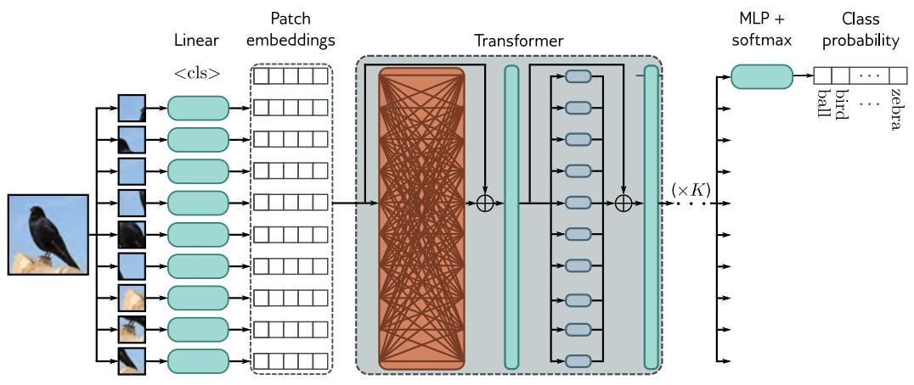

Figure 12.17 Vision transformer. The Vision Transformer (ViT) breaks the imageinto a grid of patches (16×16 in the original implementation). Each of theseis projected via a learned linear transformation to become a patch embedding.These patch embeddings are fed into a transformer encoder network, and the<cls> token is used to predict the class probabilities.

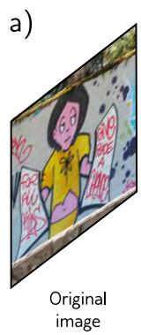

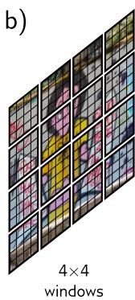

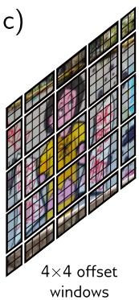

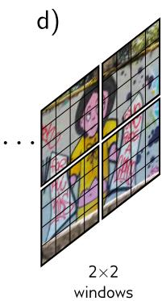

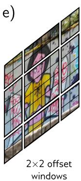

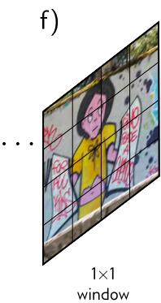

Figure 12.18 Shifted window (SWin) transformer (Liu et al., 2021c). a) Origi-nal image. b) The SWin transformer breaks the image into a grid of windowsand each of these windows into a sub-grid of patches. The transformer networkapplies self-attention to the patches within each window independently. c) Eachalternate layer shifts the windows so that the subsets of patches that interactwith one another change, and information can propagate across the whole image.d) After several layers, the $2 \times 2$ blocks of patch representations are concatenatedto increase the effective patch (and window) size. e) Alternate layers use shiftedwindows at this new lower resolution. f) Eventually, the resolution is such thatthere is just a single window, and the patches span the entire image.

A representative example of a multi-scale transformer is the shifted-window or SWintransformer. This is an encoder transformer that divides the image into patches andgroups these patches into a grid of windows within which self-attention is applied in-dependently (figure 12.18). These windows are shifted in adjacent transformers, so theeffective receptive field at a given patch can expand beyond the window border.

The scale is reduced periodically by concatenating features from non-overlapping 2×2patches and applying a linear transformation that maps these concatenated features totwice the original number of channels. This architecture does not have a <cls> tokenbut instead averages the output features at the last layer. These are then mapped via alinear layer to the desired number of classes and passed through a softmax function tooutput class probabilities. At the time of writing, the most sophisticated version of thisarchitecture achieves a 9.89% top-1 error rate on the ImageNet database.

A related idea is periodically to integrate information from across the whole image.Dual attention vision transformers (DaViT) alternate two types of transformers. In thefirst, image patches attend to one another, and the self-attention computation uses allthe channels. In the second, the channels attend to one another, and the self-attentioncomputation uses all the image patches. This architecture reaches a 9.60% top-1 errorrate on ImageNet and is close to the state-of-the-art at the time of writing.

Problem 12.9

# 12.11 Summary

This chapter introduced self-attention and the transformer architecture. Encoder, de-coder, and encoder-decoder models were then described. The transformer operates onsets of high-dimensional embeddings. It has a low computational complexity per layer,and much of the computation can be performed in parallel using the matrix form. Sinceevery input embedding interacts with every other, it can describe long-range dependen-cies in text. Ultimately, the computation scales quadratically with the sequence length;one approach to reducing the complexity is sparsifying the interaction matrix.

The training of transformers with very large unlabeled datasets is the first exampleof unsupervised learning (learning without labels) in this book. Encoders learn a repre-sentation that can be used for other tasks by predicting missing tokens. Decoders buildan autoregressive model over the inputs and are the first example of a generative modelin this book. The generative decoders can be used to create new data examples.

Chapter 13 considers networks for processing graph data. These have connectionswith transformers in that the nodes of the graph attend to one another in each networklayer. Chapters 14–18 return to unsupervised learning and generative models.

# Notes

Natural language processing: Transformers were developed for natural language processing(NLP) tasks. This is an enormous area that deals with text analysis, categorization, generation,and manipulation. Example tasks include part of speech tagging, translation, text classification,entity recognition (people, places, companies, etc.), text summarization, question answering,word sense disambiguation, and document clustering. NLP was initially tackled by rule-basedmethods that exploited the structure and statistics of grammar. See Manning & Schutze (1999)and Jurafsky & Martin (2000) for early approaches.

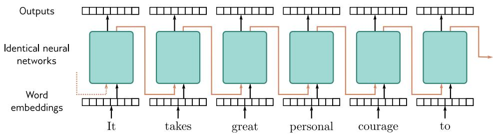

Figure 12.19 Recurrent neural networks (RNNs). The word embeddings arepassed sequentially through a series of identical neural networks. Each networkhas two outputs; one is the output embedding, and the other (orange arrows)feeds back into the next neural network, along with the next word embedding.Each output embedding contains information about the word itself and its con-text in the preceding sentence fragment. In principle, the final output containsinformation about the entire sentence and could be used to support classificationtasks similarly to the <cls> token in a transformer encoder model. However,RNNs sometimes gradually “forget” about tokens that are further back in time.

Recurrent neural networks: Before the introduction of transformers, many state-of-the-artNLP applications used recurrent neural networks, or RNNs for short (figure 12.19). The term“recurrent” was introduced by Rumelhart et al. (1985), but the main idea dates to at leastMinsky & Papert (1969). RNNs ingest a sequence of inputs (words in NLP) one at a time.At each step, the network receives both the new input and a hidden representation computedfrom the previous time step (the recurrent connection). The final output contains informationabout the whole input. This representation can then support NLP tasks like classification ortranslation. They have also been used in a decoding context in which generated tokens arefed back into the model to form the next input to the sequence. For example, the PixelRNN(Van den Oord et al., 2016c) used RNNs to build an autoregressive model of images.

From RNNs to transformers: One of the problems with RNNs is that they can forget in-formation that is further back in the sequence. More sophisticated versions of this architecture,such as long short-term memory networks or LSTMs (Hochreiter & Schmidhuber, 1997b) andgated recurrent units or GRUs (Cho et al., 2014; Chung et al., 2014) partially addressed thisproblem. However, in machine translation, the idea emerged that all of the intermediate rep-resentations in the RNN could be exploited to produce the output sentence. Moreover, certainoutput words should attend more to certain input words according to their relation (Bahdanauet al., 2015). This ultimately led to dispensing with the recurrent structure and replacing it withthe encoder-decoder transformer (Vaswani et al., 2017). Here input tokens attend to one another(self-attention), output tokens attend to those earlier in the sequence (masked self-attention),and output tokens also attend to the input tokens (cross-attention). A formal algorithmic de-scription of the transformer can be found in Phuong & Hutter (2022), and a survey of work canbe found in Lin et al. (2022). The literature should be approached with caution, as many en-hancements to transformers do not make meaningful performance improvements when carefullyassessed in controlled experiments (Narang et al., 2021).

Applications: Models based on self-attention and/or the transformer architecture have beenapplied to text sequences (Vaswani et al., 2017), image patches (Dosovitskiy et al., 2021),protein sequences (Rives et al., 2021), graphs (Veličković et al., 2019), database schema (Xuet al., 2021b), speech (Wang et al., 2020c), mathematical integration when formulated as atranslation problem (Lample & Charton, 2020), and time series (Wu et al., 2020b). However,their most celebrated successes have been in building language models and, more recently, as areplacement for convolutional networks in computer vision.

Large language models: Vaswani et al. (2017) targeted translation tasks, but transformersare now more usually used to build either pure encoder or pure decoder models, the most famousof which are BERT (Devlin et al., 2019) and GPT2/GPT3 (Radford et al., 2019; Brown et al.,2020), respectively. These models are usually tested against benchmarks like GLUE (Wanget al., 2019b), which includes the SQuAD question-answering task (Rajpurkar et al., 2016)described in section 12.6.2, SuperGLUE (Wang et al., 2019a) and BIG-bench (Srivastava et al.,2022), which combine many NLP tasks to create an aggregate score for measuring languageability. Decoder models are generally not fine-tuned for these tasks but can perform well anywaywhen given a few examples of questions and answers and asked to complete the text from thenext question. This is referred to as few-shot learning (Brown et al., 2020).

Since GPT3, many decoder language models have been released with steady improvement infew-shot results. These include GLaM (Du et al., 2022), Gopher (Rae et al., 2021), Chinchilla(Hoffmann et al., 2023), Megatron-Turing NLG (Smith et al., 2022), and LaMDa (Thoppilanet al., 2022). Most of the performance improvement is attributable to increased model size,using sparsely activated modules, and exploiting larger datasets. At the time of writing, themost recent model is PaLM (Chowdhery et al., 2022), which has 540 billion parameters andwas trained on 780 billion tokens across 6144 processors. Interestingly, since text is highlycompressible, this model has more than enough capacity to memorize the entire training dataset.This is true for many language models. Many bold statements have been made about how largelanguage models exceed human performance. This is probably true for some tasks, but suchstatements should be treated with caution (see Ribeiro et al.,2021; McCoy et al., 2019; Bowman& Dahl, 2021; and Dehghani et al., 2021).

These models have considerable world knowledge. For example, in section 12.7.4, the modelknows key facts about deep learning, including that it is a type of machine learning withassociated algorithms and applications. Indeed, one such model has been mistakenly identifiedas being sentient (Clark, 2022). However, there are persuasive arguments that the degree of“understanding” this type of model can ever have is limited (Bender & Koller, 2020).

Tokenizers: Schuster & Nakajima (2012) and Sennrich et al. (2015) introduced WordPieceand byte pair encoding (BPE), respectively. Both methods greedily merge pairs of tokens basedon their frequency of adjacency (figure 12.8), with the main difference being how the initialtokens are chosen. For example, in BPE, the initial tokens are characters or punctuation witha special token to denote whitespace. The merges cannot occur over the whitespace. As thealgorithm proceeds, new tokens are formed by combining characters recursively so that sub-word and word tokens emerge. The unigram language model (Kudo, 2018) generates severalpossible candidate merges and chooses the best one based on the likelihood in a language model.Provilkov et al. (2020) develop BPE dropout, which generates the candidates more efficientlyby introducing randomness into the process of counting frequencies. Versions of both byte pairencoding and the unigram language model are included in the SentencePiece library (Kudo &Richardson, 2018), which works directly on Unicode characters and can work with any language.He et al. (2020) introduce a method that treats the sub-word segmentation as a latent variablethat should be marginalized out for learning and inference.

Decoding algorithms: Transformer decoder models take a body of text and return a prob-ability over the next token. This is then added to the preceding text, and the model is runagain. The process of choosing tokens from these probability distributions is known as decoding.Näive ways to do this would be to either (i) greedily choose the most likely token or (ii) choosea token randomly according to the distribution. However, neither of these methods works wellin practice. In the former case, the results may be very generic, and the latter case may leadto degraded quality outputs (Holtzman et al., 2020). This is partly because, during training,the model was only exposed to sequences of ground truth tokens (known as teacher forcing) butsees its own output when deployed.

It is not computationally feasible to try every combination of tokens in the output sequence,but it is possible to maintain a fixed number of parallel hypotheses and choose the most likelyoverall sequence. This is known as beam search. Beam search tends to produce many similarhypotheses and has been modified to investigate more diverse sequences (Vijayakumar et al.,2016; Kulikov et al., 2018). One possible problem with random sampling is that there is a verylong tail of unlikely following words that collectively have a significant probability. This hasled to the development of top-K sampling, in which tokens are sampled from only the K mostlikely hypotheses (Fan et al., 2018). Top-K sampling still sometimes allows unreasonable tokenchoices when there are only a few high-probability choices. To resolve this problem, Holtzmanet al. (2020) proposed nucleus sampling, in which tokens are sampled from a fixed proportion ofthe total probability mass. El Asri & Prince (2020) discuss decoding algorithms in more depth.

Types of attention: Scaled dot-product attention (Vaswani et al., 2017) is just one of afamily of attention mechanisms that includes additive attention (Bahdanau et al., 2015), multi-plicative attention (Luong et al., 2015), key-value attention (Daniluk et al., 2017), and memory-compressed attention (Liu et al., 2019c). Zhai et al. (2021) constructed “attention-free” trans-formers, in which the tokens interact in a way that does not have quadratic complexity. Multi-head attention was also introduced by Vaswani et al. (2017). Interestingly, it appears that mostof the heads can be pruned after training without critically affecting the performance (Voitaet al., 2019); it has been suggested that their role is to guard against bad initializations. Hu et al.(2018b) propose squeeze-and-excitation networks, attention-like mechanisms that re-weight thechannels in a convolutional layer based on globally computed features.

Relationship of self-attention to other models: The self-attention computation has closeconnections to other models. First, it is an example of a hypernetwork (Ha et al., 2017) in thatit uses one part of the network to choose the weights of another part: the attention matrix formsthe weights of a sparse network layer that maps the values to the outputs (figure 12.3). Thesynthesizer (Tay et al., 2021) simplifies this idea by simply using a neural network to create eachrow of the attention matrix from the corresponding input. Even though the input tokens nolonger interact with each other to create the attention weights, this works surprisingly well. Wuet al. (2019) present a similar system that produces an attention matrix with a convolutionalstructure so the tokens attend to their neighbors. The gated multi-layer perceptron (Wu et al.,2019) computes a matrix that pointwise multiplies the values and hence modifies them withoutmixing them. Transformers are also closely related to fast weight memory systems, which werethe intellectual forerunners of hypernetworks (Schlag et al., 2021).

Self-attention can also be thought of as a routing mechanism (figure 12.1), and from this view-point, there is a connection to capsule networks (Sabour et al., 2017). These capture hierarchicalrelations in images; lower network levels might detect facial parts (noses, mouths), which arethen combined (routed) in higher-level capsules that represent a face. However, capsule net-works use routing by agreement. In self-attention, the inputs compete with each other for howmuch they contribute to a given output (via the softmax operation). In capsule networks, theoutputs of the layer compete with each other for inputs from earlier layers. Once we considerself-attention as a routing network, we can question whether making this routing dynamic (i.e.,dependent on the data) is necessary. The random synthesizer (Tay et al., 2021) removed the de-pendence of the attention matrix on the inputs entirely and either used predetermined randomvalues or learned values. This performed surprisingly well across a variety of tasks.

Multi-head self-attention also has close connections to graph neural networks (see chapter 13),convolution (Cordonnier et al., 2020), recurrent neural networks (Choromanski et al., 2020),and memory retrieval in Hopfield networks (Ramsauer et al., 2021). For more information onthe relationships between transformers and other models, consult Prince (2021a).

Positional encoding: The original transformer paper (Vaswani et al., 2017) experimentedwith predefining the positional encoding matrix Π, and learning the positional encoding Π.It might seem odd to add the positional encodings to the D × N data matrix X rather thanconcatenate them. However, the data dimension D is usually greater than the number oftokens N, so the positional encoding lies in a subspace. The word embeddings in X are learned,so the system can theoretically keep the two components in orthogonal subspaces and retrievethe positional encodings as required. The predefined embeddings chosen by Vaswani et al.(2017) were a family of sinusoidal components with two attractive properties: (i) the relativeposition of two embeddings is easy to recover using a linear operation and (ii) their dot productgenerally decreased as the distance between positions increased (see Prince, 2021a, for moredetails). Many systems, such as GPT3 and BERT, learn positional encodings. Wang et al.(2020a) examined the cosine similarities of the positional encodings in these models and showedthat they generally decline with relative distance, although they also have a periodic component.

Much subsequent work has modified just the attention matrix so that in the scaled dot productself-attention equation:

$$
\mathbf {S a} [ \mathbf {X} ] = \mathbf {V} \cdot \text { Softmax } \left[ \frac {\mathbf {K} ^ {T} \mathbf {Q}}{\sqrt {D _ {q}}} \right], \tag {12.16}
$$

only the queries and keys contain position information:

$$
\mathbf {V} = \boldsymbol {\beta} _ {v} \mathbf {1} ^ {\mathbf {T}} + \boldsymbol {\Omega} _ {v} \mathbf {X}
$$

$$
{\bf Q} = {\boldsymbol {\beta} _ {q} \mathbf {1} ^ {\mathrm{T}} + \boldsymbol {\Omega} _ {q} (\mathbf {X} + \boldsymbol {\Pi})}
$$

$$
\mathbf {K} = \boldsymbol {\beta} _ {k} \mathbf {1} ^ {\mathrm{T}} + \boldsymbol {\Omega} _ {k} (\mathbf {X} + \boldsymbol {\Pi}). \tag {12.17}
$$

This has led to the idea of multiplying out the quadratic component in the numerator of equa-tion 12.16 and retaining only some of the terms. For example, Ke et al. (2021) decouple or untiethe content and position information by retaining only the content-content and position-positionterms and using different projection matrices Ω for each.

Another modification is to inject information directly about the relative position. This is moreimportant than absolute position since a batch of text can start at an arbitrary place in adocument. Shaw et al. (2018), Raffel et al. (2020), and Huang et al. (2020b) all developedsystems where a single term was learned for each relative position offset, and the attentionmatrix was modified in various ways using these relative positional encodings. Wei et al. (2019)investigated relative positional encodings based on predefined sinusoidal embeddings rather thanlearned values. DeBERTa (He et al., 2021) combines these ideas; they retain only a subset ofterms from the quadratic expansion, apply different projection matrices to them, and use relativepositional encodings. Other work has explored sinusoidal embeddings that encode absolute andrelative position information in more complex ways (Su et al., 2021).

Wang et al. (2020a) compare the performance of transformers in BERT with different posi-tional encodings. They found that relative positional encodings perform better than absolutepositional encodings, but there was little difference between using sinusoidal and learned em-beddings. A survey of positional encodings can be found in Dufter et al. (2021).

Extending transformers to longer sequences: The complexity of the self-attention mech-anism increases quadratically with the sequence length. Some tasks like summarization orquestion answering may require long inputs, so this quadratic dependence limits performance.Three lines of work have attempted to address this problem. The first decreases the size of theattention matrix, the second makes the attention sparse, and the third modifies the attentionmechanism to make it more efficient.

To decrease the size of the attention matrix, Liu et al. (2018b) introduced memory-compressedattention. This applies strided convolution to the keys and values, which reduces the numberof positions in a very similar way to downsampling in a convolutional network. Attention isnow applied between weighted combinations of neighboring positions, where the weights arelearned. Along similar lines, Wang et al. (2020b) observed that the quantities in the attentionmechanism are often low rank in practice and developed the LinFormer, which projects the keysand values onto a smaller subspace before computing the attention matrix.

To make attention sparse, Liu et al. (2018b) proposed local attention, in which neighboringblocks of tokens only attend to one another. This creates a block diagonal interaction matrix (seefigure 12.15). Information cannot pass from block to block, so such layers are typically alternatedwith full attention. Along the same lines, GPT3 (Brown et al., 2020) uses a convolutionalinteraction matrix and alternates this with full attention. Child et al. (2019) and Beltagy et al.(2020) experimented with various interaction matrices, including convolutional structures withdifferent dilation rates but allowing some queries to interact with every other key. Ainslieet al. (2020) introduced the extended transformer construction (figure 12.15h), which uses aset of global embeddings that interact with every other token. This can only be done in theencoder version, or these implicitly allow the system to “look ahead.” When combined withrelative position encoding, this scheme requires special encodings for mapping to, from, andbetween these global embeddings. BigBird (Ainslie et al., 2020) combined global embeddingsand a convolutional structure with a random sampling of possible connections. Other workhas investigated learning the sparsity pattern of the attention matrix (Roy et al., 2021; Kitaevet al., 2020; Tay et al., 2020).

Finally, it has been noted that the terms in the numerator and denominator of the softmax oper-ation that computes attention have the form exp[kT q]. This can be treated as a kernel functionand, as such, can be expressed as the dot product g[k]T g[q] where g[•] is a nonlinear transforma-tion. This formulation decouples the queries and keys, making the attention computation moreefficient. Unfortunately, to replicate the form of the exponential terms, the transformation g[•]must map the inputs to the infinite space. The linear transformer (Katharopoulos et al., 2020)recognizes this and replaces the exponential term with a different similarity measure. The Per-former (Choromanski et al., 2020) approximates this infinite mapping with a finite-dimensionalone. More details about extending transformers to longer sequences can be found in Tay et al.(2023) and Prince (2021a).

Training transformers: Training transformers is challenging and requires both learning ratewarm-up (Goyal et al., 2018) and Adam (Kingma & Ba, 2015). Indeed Xiong et al. (2020a) andHuang et al. (2020a) show that the gradients vanish, and the Adam updates decrease in magni-tude without learning rate warm-up. Several interacting factors cause this problem. Residualconnections cause the exploding gradients (figure 11.6), but normalization layers prevent this.Vaswani et al. (2017) used LayerNorm rather than BatchNorm because NLP statistics are highlyvariable between batches, although subsequent work has modified BatchNorm for transformers(Shen et al., 2020a). The positioning of the LayerNorm outside of the residual block causesgradients to shrink as they pass back through the network (Xiong et al., 2020a). In addition,the relative weight of the residual connections and main self-attention mechanism varies as wemove through the network upon initialization (see figure 11.6c). There is the additional com-plication that the gradients for the query and key parameters are smaller than for the valueparameters (Liu et al., 2020), which necessitates the use of Adam. These factors interact in acomplex way, making training unstable and necessitating learning rate warm-up.

There have been various attempts to stabilize training, including (i) a variation of FixUp calledTFixup (Huang et al., 2020a) that allows the LayerNorm components to be removed, (ii) chang-ing the position of the LayerNorm components in the network (Liu et al., 2020), and (iii)re-weighting the two paths in the residual branches (Liu et al., 2020; Bachlechner et al., 2021).Xu et al. (2021b) introduced an initialization scheme called DTFixup that allows transformersto be trained with smaller datasets. A detailed discussion can be found in Prince (2021b).

Applications in vision: ImageGPT (Chen et al., 2020a) and the Vision Transformer (Doso-vitskiy et al., 2021) were both early transformer architectures applied to images. Transformershave been used for image classification (Dosovitskiy et al., 2021; Touvron et al., 2021), objectdetection (Carion et al., 2020; Zhu et al., 2020b; Fang et al., 2021), semantic segmentation (Yeet al., 2019; Xie et al., 2021; Gu et al., 2022), super-resolution (Yang et al., 2020a), actionrecognition (Sun et al., 2019; Girdhar et al., 2019), image generation (Chen et al., 2021b; Nashet al., 2021), visual question answering (Su et al., 2019b; Tan & Bansal, 2019), inpainting (Wanet al., 2021; Zheng et al., 2021; Zhao et al., 2020b; Li et al., 2022), colorization (Kumar et al.,2021), and many other vision tasks (Khan et al., 2022; Liu et al., 2023b).

Transformers and convolutional networks: Transformers have been combined with con-volutional neural networks for many tasks, including image classification (Wu et al., 2020a),object detection (Hu et al., 2018a; Carion et al., 2020), video processing (Wang et al., 2018c;Sun et al., 2019), unsupervised object discovery (Locatello et al., 2020) and various text/visiontasks (Chen et al., 2020d; Lu et al., 2019; Li et al., 2019). Transformers can outperform convolu-tional networks for vision tasks but usually require large quantities of data to achieve superiorperformance. Often, they are pre-trained on enormous datasets like JRT (Sun et al., 2017)and LAION (Schuhmann et al., 2021). The transformer doesn’t have the inductive bias ofconvolutional networks, but by using huge amounts of data, it can surmount this disadvantage.

From pixels to video: Non-local networks (Wang et al., 2018c) were an early application ofself-attention to image data. Transformers were initially applied to pixels in local neighborhoods(Parmar et al., 2018; Hu et al., 2019; Parmar et al., 2019; Zhao et al., 2020a). ImageGPT (Chenet al., 2020a) scaled this to model all pixels in a small image. The Vision Transformer (ViT)(Dosovitskiy et al., 2021) used non-overlapping patches to analyze bigger images.

Since then, many multi-scale systems have been developed, including the SWin transformer(Liu et al., 2021c), SWinV2 (Liu et al., 2022), multi-scale transformers (MViT) (Fan et al.,2021), and pyramid vision transformers (Wang et al., 2021). The Crossformer (Wang et al.,2022b) models interactions between spatial scales. Ali et al. (2021) introduced cross-covarianceimage transformers, in which the channels rather than spatial positions attend to one another,hence making the size of the attention matrix indifferent to the image size. The dual attentionvision transformer (DaViT) was developed by Ding et al. (2022) and alternates between localspatial attention within sub-windows and spatially global attention between channels. Chu et al.(2021) similarly alternate between local attention within sub-windows and global attention bysubsampling the spatial domain. Dong et al. (2022) adapt the ideas of figure 12.15, in whichthe interactions between elements are sparsified to the 2D image domain.

Transformers were subsequently adapted to video processing (Arnab et al., 2021; Bertasius et al.,2021; Liu et al., 2021c; Neimark et al., 2021; Patrick et al., 2021). A survey of transformersapplied to video can be found in Selva et al. (2022).

Combining images and text: CLIP (Radford et al., 2021) learns a joint encoder for imagesand their captions using a contrastive pre-training task. The system ingests N images andtheir captions and produces a matrix of compatibility between images and captions. The lossfunction encourages the correct pairs to have a high score and the incorrect pairs to have a lowscore. Ramesh et al. (2021) and Ramesh et al. (2022) train a diffusion decoder to invert theCLIP image encoder for text-conditional image generation (see chapter 18).

# Problems

Problem 12.1 Consider a self-attention mechanism that processes N inputs of length D toproduce N outputs of the same size. How many weights and biases are used to compute thequeries, keys, and values? How many attention weights $\mathrm { a } [ \bullet , \bullet ]$ will there be? How many weightsand biases would there be in a fully connected network relating all DN inputs to all DNoutputs?

Problem 12.2 Why might we want to ensure that the input to the self-attention mechanism isthe same size as the output?

Problem 12.3∗ Show that the self-attention mechanism (equation 12.8) is equivariant to apermutation XP of the data X, where P is a permutation matrix. In other words, show that:

$$
\mathbf {S a} [ \mathbf {X P} ] = \mathbf {S a} [ \mathbf {X} ] \mathbf {P}. \tag {12.18}
$$

Problem 12.4 Consider the softmax operation:

$$
y _ {i} = \operatorname{softmax} _ {i} [ \mathbf {z} ] = \frac {\exp [ z _ {i} ]}{\sum_ {j = 1} ^ {5} \exp [ z _ {j} ]}, \tag {12.19}
$$

in the case where there are five inputs with values: $z _ { 1 } = - 3 , z _ { 2 } = 1 , z _ { 3 } = 1 0 0 , z _ { 4 } = 5 , z _ { 5 } = - 1$ .Compute the 25 derivatives, $\partial y _ { i } / \partial z _ { j }$ for all $i , j \in \{ 1 , 2 , 3 , 4 , 5 \}$ . What do you conclude?

Problem 12.5 Why is implementation more efficient if the values, queries, and keys in each ofthe H heads each have dimension $D / H$ where D is the original dimension of the data?

Problem 12.6 BERT was pre-trained using two tasks. The first task requires the system to pre-dict missing (masked) words. The second task requires the system to classify pairs of sentencesas being adjacent or not in the original text. Identify whether each of these tasks is generativeor contrastive (see section 9.3.6). Why do you think they used two tasks? Propose two novelcontrastive tasks that could be used to pre-train a language model.

Problem 12.7 Consider adding a new token to a precomputed masked self-attention mechanismwith N tokens. Describe the extra computation that must be done to incorporate this newtoken.

Problem 12.8 Computation in vision transformers expands quadratically with the number ofpatches. Devise two methods to reduce the computation using the principles from figure 12.15.

Problem 12.9 Consider representing an image with a grid of $1 6 \times 1 6$ patches, each representedby a patch embedding of length 512. Compare the amount of computation required in theDaViT transformer to perform attention (i) between the patches, using all of the channels, and(ii) between the channels, using all of the patches.

Problem 12.10∗ Attention weights are usually computed as:

$$
a \left[ \mathbf {x} _ {m}, \mathbf {x} _ {n} \right] = \operatorname{softmax} _ {m} \left[ \mathbf {k} _ {\bullet} ^ {T} \mathbf {q} _ {n} \right] = \frac {\exp \left[ \mathbf {k} _ {m} ^ {T} \mathbf {q} _ {n} \right]}{\sum_ {m ^ {\prime} = 1} ^ {N} \exp \left[ \mathbf {k} _ {m ^ {\prime}} ^ {T} \mathbf {q} _ {n}\right)}. \tag {12.20}
$$

Consider replacing exp $\left[ \mathbf { k } _ { m } ^ { T } \mathbf { q } _ { n } \right]$ with the dot product $\mathbf { g } [ \mathbf { k } _ { m } ] ^ { T } \mathbf { g } [ \mathbf { q } _ { n } ]$ where $\mathbf { g } [ \bullet ]$ is a nonlineartransformation. Show how this makes the computation of the attention weights more efficient.